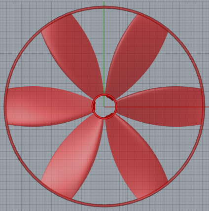
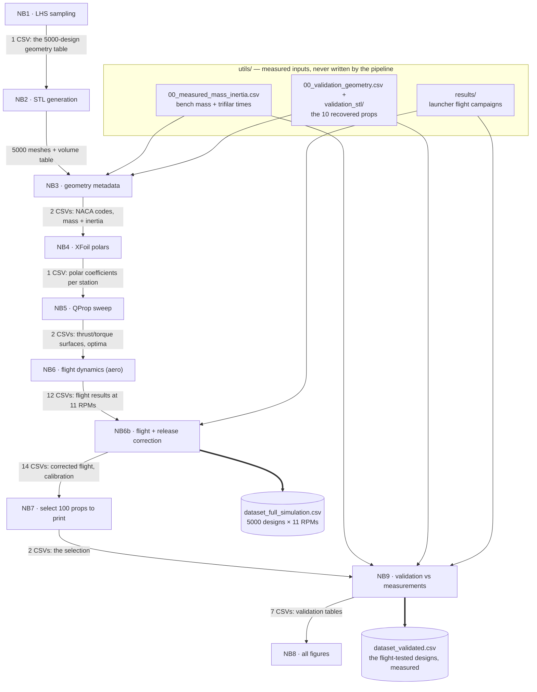

# IDEAL Propeller Characterisation Pipeline

**Data-driven testing and characterisation of 3D-printed propeller performance**

Bachelor Thesis · IDEAL Lab (Chair of Artificial Intelligence in Engineering Design) · ETH Zürich
Author: Héctor Fernández Pinacho · Supervisors: Prof. Dr. Mark Fuge, Arthur Drake

<p align="center">
  
</p>

---

## Contents

1. [Introduction](#1-introduction)
2. [Physics Background](#2-physics-background)
3. [Pipeline Overview and DAG](#3-pipeline-overview-and-dag)
4. [What Is in This Repository](#4-what-is-in-this-repository)
5. [Installation and Configuration](#5-installation-and-configuration)
6. [Running the Pipeline — What Appears on Disk](#6-running-the-pipeline--what-appears-on-disk)
7. [Notebook Deep Dive](#7-notebook-deep-dive)
   - [7.1 NB1 — 1_lhs_sampling.ipynb · LHS Geometrical Parameter Sampling](#71-nb1--1_lhs_samplingipynb--lhs-geometrical-parameter-sampling)
   - [7.2 NB2 — 2_stl_generation.ipynb · STL Generation](#72-nb2--2_stl_generationipynb--stl-generation)
   - [7.3 NB3 — 3_geometry_metadata.ipynb · Geometry Metadata](#73-nb3--3_geometry_metadataipynb--geometry-metadata)
   - [7.4 NB4 — 4_xfoil_simulation.ipynb · XFoil Aerodynamic Polar Generation](#74-nb4--4_xfoil_simulationipynb--xfoil-aerodynamic-polar-generation)
   - [7.5 NB5 — 5_qprop_simulation.ipynb · QProp Performance Sweep](#75-nb5--5_qprop_simulationipynb--qprop-performance-sweep)
   - [7.6 NB6 — 6_flight_dynamics.ipynb · Flight Dynamics](#76-nb6--6_flight_dynamicsipynb--flight-dynamics)
   - [7.7 NB6b — 6b_flight_dynamics_release.ipynb · Flight Dynamics with Screw-Release Model](#77-nb6b--6b_flight_dynamics_releaseipynb--flight-dynamics-with-screw-release-model)
   - [7.8 NB7 — 7_representative_selection.ipynb · Representative Propeller Selection](#78-nb7--7_representative_selectionipynb--representative-propeller-selection)
   - [7.9 NB8 — 8_visualization.ipynb · Design-Space and Pipeline Visualisation](#79-nb8--8_visualizationipynb--design-space-and-pipeline-visualisation)
   - [7.10 NB9 — 9_validation.ipynb · Validation (Mass, Inertia, Simulation)](#710-nb9--9_validationipynb--validation-mass-inertia-simulation)
8. [The Two Datasets](#8-the-two-datasets)
9. [The Results Dashboard](#9-the-results-dashboard)

---

## 1. Introduction

The goal of this pipeline is to build a **dataset of 5000 3D-printable propeller designs**, where every design carries both its full **geometric description** (17 parameters) and its **simulated performance** — static thrust and torque, thrust-to-weight ratio, and above all **h_max**: the peak height the propeller reaches when spun up to a launch RPM and released into free vertical flight. Eleven launch RPMs (1500–6500) are simulated per design, giving a flat, machine-learning-ready table of 55 000 rows.

Because a simulated number is only worth what its validation says, the pipeline closes the loop physically: **100 designs** are selected to cover the design space, printed in SLS nylon, and measured on a precision scale and a trifilar pendulum (a platform hanging on three strings — the time it takes to oscillate around the vertical axis gives the moment of inertia); **30 of them are flown** across the full RPM range on a vertical free-flight launcher that spins each prop to a set rate, releases it, and records its climb. The measured results become a second dataset with the same identifiers, so simulation and reality can be joined row by row.

Everything is organised as ten Jupyter notebooks forming a strict pipeline (no stage reads the output of a later stage), a single configuration module, and a `utils/` folder holding every input the pipeline *uses* but never *writes* — measured data, launcher test campaigns, the parametric CAD definition and the aerodynamic solvers. This repository contains exactly that: **the code and `utils/`**. Everything else you will see mentioned in this README (`csv/`, `stl/`, `plots/`, solver caches, the two datasets) is *generated* by running the notebooks.

---

## 2. Physics Background

Four ideas are enough to read everything else.

**A blade section is an airfoil.** Cut a propeller blade at any radius and you get a NACA 4-digit airfoil described by chord, thickness and camber. Its lift and drag depend on the angle of attack and are summarised by its *polar*, which we compute with **XFoil**. These propellers are small and slow, so many sections operate at very low Reynolds numbers (Re < 20 000) where the flow is delicate and XFoil does not always converge. When it fails at a station's target Reynolds number, the pipeline falls back step by step: first it reuses the closest converged polar of the same airfoil at a nearby Reynolds number (rescaled), the hub may borrow its neighbouring station's polar, and a station with nothing usable is dropped and flagged. Every design records a **confidence score** (0–1) saying how much of its blade is backed by directly converged polars.

**Blade elements add up to a propeller.** **QProp** combines the section polars along the blade (blade-element/vortex theory) into whole-propeller thrust T and torque Q at any operating point (flight speed V, rotation speed RPM). We tabulate T(V, ω) and Q(V, ω) over a grid once per design.

**Free flight is a small ODE.** After release the propeller climbs under its own thrust while its spin decays, because nothing drives it anymore:

```
m·dV/dt = T(V, ω) − m·g − D(V)      I·dω/dt = −Q(V, ω)      dh/dt = V
```

Mass m comes from the STL volume times a print density calibrated on 100 weighed parts; the spin inertia I from the STL inertia tensor with a measured correction; D is the drag of the non-blade structure. Integrating this gives h_max.

**The launcher is not ideal.** The release mechanism unscrews the spinning prop off its pin, stripping most of the spin and adding a small upward kick. A two-parameter monotonic correction `h = A + B·h_aero`, calibrated live on the launcher data in `utils/results/`, maps the idealised aerodynamic height onto what the rig actually achieves — it preserves the design *ranking* exactly while fixing the absolute heights (mean error drops from ≈1.4 m to ≈0.2 m).

One more tool: the 5000 designs are drawn by **constrained Latin Hypercube Sampling**, which covers the 17-dimensional space evenly while enforcing printability (wall thickness, solidity) and aerodynamic sanity (taper, monotonic twist, angle-of-attack windows); and the 100 printed designs are chosen by **greedy k-centre** so they span that space with a guaranteed covering radius.

---

## 3. Pipeline Overview and DAG

Ten notebooks, run in order. Each is structured identically — **1. Imports · 2. Configuration · 3. Function Definitions · 4. Main Code** — takes its parameters from `pipeline_config.py`, and ends with pass/fail checks on its own outputs.

| Stage | Notebook | In one line |
|---|---|---|
| NB1 | `1_lhs_sampling` | sample 5000 constrained designs → `csv/01_geometry.csv` |
| NB2 | `2_stl_generation` | mesh each design via Grasshopper/RhinoCompute → `stl/`, volumes |
| NB3 | `3_geometry_metadata` | NACA codes per station; calibrated mass + inertia per STL |
| NB4 | `4_xfoil_simulation` | XFoil polars for every blade station over a Reynolds grid |
| NB5 | `5_qprop_simulation` | QProp thrust/torque surfaces over the (V, RPM) grid |
| NB6 | `6_flight_dynamics` | free-flight ODE at 11 launch RPMs (idealised, aero-only) |
| NB6b | `6b_flight_dynamics_release` | same flight + launcher release correction → **full dataset** |
| NB7 | `7_representative_selection` | greedy k-centre pick of 100 props for fabrication |
| NB8 | `8_visualization` | every figure of the project → `plots/` |
| NB9 | `9_validation` | mass, inertia and flight vs measurements → **validated dataset** |

Solid arrows are file dependencies; every notebook also reads `pipeline_config.py`. The yellow box is this repository's `utils/` folder — measured inputs that no notebook ever writes.



The chain is drawn as a single line for readability — in reality later notebooks also re-read `csv/01_geometry.csv` and other earlier outputs directly (everything is keyed by `config_id`), and every notebook reads `pipeline_config.py`. The labels tell you roughly what each stage hands downstream; the exact files are listed per notebook in Section 7.

**Why 10 props get special treatment (the "validation subset").** The physical test campaign happened against an *earlier version* of this pipeline: 10 props were printed and flight-tested first, and later the code was revised and fully re-run. The re-run changed two things at once — NB1's sampling assigned **different geometries to the same `config_id`s**, and NB7 picked a **different representative subset**. So for those 10 early props, the current `csv/01_geometry.csv` row under their id describes a design that was never printed, while the actual printed parts (and their flight data in `utils/results/`) still existed and were too valuable to throw away. The solution: their true as-printed geometry is frozen in `utils/00_validation_geometry.csv` and their actual meshes in `utils/validation_stl/`. NB3, NB4, NB5, NB6 and NB6b each end with a short *Validation Subset* section that re-runs the exact same computation on those 10 recorded geometries (writing `val_`-prefixed twins of their outputs, e.g. `val_04_xfoil_polars.csv`), and NB9 merges them in automatically — extending the flight validation from the 20 tested props of the current subset to all 30 physically flown props.

---

## 4. What Is in This Repository

```
├── 1_lhs_sampling.ipynb … 9_validation.ipynb   the pipeline (10 notebooks)
├── pipeline_config.py        every tunable parameter of every notebook
├── dashboard.html            interactive results browser (works once the CSVs exist)
├── requirements.txt          pinned dependencies (Python 3.11)
│
└── utils/                    everything the pipeline USES but never writes
    ├── measurements.py                single access point for all measured data
    ├── 00_measured_mass_inertia.csv   bench measurements: scale mass + trifilar
    │                                  oscillation time per fabricated prop
    ├── 00_validation_geometry.csv     true geometry of the 30 flight-tested props
    │                                  (geometry_source / stl_source provenance)
    ├── results/                       raw launcher test campaigns — per-run flight
    │                                  traces in *_cleaned/ batch folders
    ├── validation_stl/                printed meshes of the 10 early-tested props
    ├── Propeller_Raul_V1.2.gh         parametric Grasshopper propeller generator (NB2)
    ├── xfoil.exe                      XFoil solver, Windows binary (NB4)
    ├── qprop.exe · motor.mas          QProp solver + motor file (NB5)
    └── propeller.png                  the image above
```

That is the complete repository. The split is deliberate: **inputs live in `utils/`, outputs are reproducible** — so this repo plus a Rhinoceros 8 installation is sufficient to regenerate every mesh, every table and every figure from scratch (Section 6 shows what appears where).

---

## 5. Installation and Configuration

**Python 3.11 is required** — all versions in `requirements.txt` are pinned against it.

1. Install [Python 3.11](https://www.python.org/downloads/) (on Windows, tick *Add python.exe to PATH*).
2. Create and activate a virtual environment in the repo folder:

   ```
   py -3.11 -m venv .venv          (Windows)
   .venv\Scripts\activate

   python3.11 -m venv .venv        (macOS / Linux)
   source .venv/bin/activate
   ```

3. `pip install -r requirements.txt`
4. External tools: `utils/xfoil.exe` and `utils/qprop.exe` are bundled Windows binaries, so NB4/NB5 need Windows (or Wine); NB1, NB3, NB6–NB9 are pure Python and run anywhere. **NB2 additionally requires Rhinoceros 8** — the notebook launches its bundled RhinoCompute server itself (`RHINO_COMPUTE_EXE` in `pipeline_config.py` points to it).
5. `jupyter notebook` from the activated environment.

**Configuration.** Every tunable parameter of every notebook lives in **`pipeline_config.py`**, organised in commented per-stage sections: the operating envelope (RPM grid, 11 launch RPMs, reference launch RPM), physical constants, NB1's slider bounds/seeds/feasibility constraints, NB2's RhinoCompute settings, NB4's XFoil settings and Reynolds grid, NB5's QProp grid and plausibility gates, NB6/NB6b's ODE tolerances and drag model, NB7's selection budgets, NB8's figure settings, NB9's validation switches, and the canonical output filenames. Each notebook's Configuration cell only *aliases* from this module — change values here, never inside a notebook. `python pipeline_config.py` prints a self-test summary.

**Measured data** is accessed exclusively through **`utils/measurements.py`**, which owns the paths of everything in `utils/`, the trifilar-pendulum rig constants and the period-to-inertia conversion. To extend the experimental record later, append bench rows to `utils/00_measured_mass_inertia.csv` and drop new cleaned launcher runs under `utils/results/` — then re-run NB3 → NB9.

---

## 6. Running the Pipeline — What Appears on Disk

Run the notebooks in order, each top to bottom. This is what your folder looks like as you go:

**After NB1** (seconds, deterministic — fixed seeds): a `csv/` folder appears with `01_geometry.csv` — 5000 rows × 18 columns, one per design, the 17 geometry parameters keyed by `config_id` (0–4999). This id is the primary key of everything that follows.

**After NB2** (hours; Rhino required): `stl/` with one binary mesh per design (`prop_<id>.stl`, ~2 MB each, ≈10 GB total) and `csv/02_stl_volumes.csv` with the enclosed volume and `stl_ok`/`single_solid` validity flags. A handful of extreme geometries fail to mesh — the batch cell retries them over several passes and the flags record the survivors. Re-runnable: existing meshes are skipped.

**After NB3** (minutes): `csv/03_naca_codes.csv` (the airfoil code at each blade station), `csv/03_mass_inertia.csv` (calibrated mass, full inertia tensor, corrected `izz_regressed`), three calibration audit tables, and the first `val_` twins (`val_02`, `val_03_*`) for the 10 recovered props.

**After NB4** (hours cold): `xfoil_polars/` — a cache of raw XFoil polar files (~4000 of them, named `naca<code>_re<Re>_xtr<x>_n5.txt`) plus `xfoil_polars/validation/` for the subset — and `csv/04_xfoil_polars.csv`: per design, the ten aerodynamic coefficients QProp needs at each of 7 stations, each station labelled with its solution tier — `viscous` (solved directly), `viscous_near_re` (nearest converged Reynolds number reused), `hub_uses_s1` (hub borrows the neighbouring station), `failed` (station dropped) — plus the per-design confidence score described in Section 2. Fully cached: a re-run computes nothing that already exists.

**After NB5** (hours cold): `qprop_input/props/` (one QProp geometry file per design), `qprop_output/` (raw solver output per design, ~4 GB), and two tables: `csv/05_qprop_results.csv` (per-design optima: hover point, best figure of merit — hover efficiency, ideal power over actual power — and best propulsive efficiency) and `csv/05_qprop_sweep.csv.gz` (the full T/Q surfaces: one row per design × 231 grid points).

**After NB6 + NB6b** (tens of minutes): `csv/06_flight_dynamics_<rpm>rpm.csv` ×11 and the `06b_*` release-corrected equivalents, the fitted correction in `csv/06b_release_calibration.csv`, and the first headline deliverable: **`csv/dataset_full_simulation.csv`** — 55 000 rows × 40 columns.

**After NB7** (seconds): `csv/07_selected.csv` + `csv/07_all_subsets.csv` (the 100-prop fabrication subset with band/tier labels) and `representative_stl/` (their meshes, copied). Read the reproducibility note in Section 7.8 before re-running this one.

**After NB9** (minutes): the six `csv/validation_*` tables (mass, inertia, the matched sim-vs-measured flight cells, rankings, summaries) and the second headline deliverable: **`csv/dataset_validated.csv`**.

**After NB8** (minutes): `plots/nb1/` … `plots/nb9/` — every figure of the project as PNG, one folder per stage. Run it after NB9; the validation figures are skipped gracefully until NB9's tables exist.

The full cold run is dominated by NB2, NB4 and NB5 (hours each); everything else is minutes. All stages are cached and re-runnable.

---

## 7. Notebook Deep Dive

Each notebook follows the same structure — **1. Imports · 2. Configuration · 3. Function Definitions · 4. Main Code** — and ends with pass/fail checks on its own outputs. The subsections below document, for every notebook: what it does, what its inputs and outputs look like, every function it defines, and what each block of the main code does.


### 7.1 NB1 — `1_lhs_sampling.ipynb` · LHS Geometrical Parameter Sampling

#### Purpose

Generates the full propeller design space using constrained Latin Hypercube Sampling (LHS). Each of the 5000 configurations is defined by 17 geometric parameters describing the tip radius, blade count, support ring, and the chord, thickness, camber, max-camber position and pitch angle of the three blade cross-sections (inner, mid, outer). Sampling is constrained so that every design is printable and aerodynamically sensible: minimum absolute wall thickness, solidity limits at the hub and mid stations, chord and thickness taper, monotonic twist, and a per-station angle-of-attack window derived from the inflow angle at the reference RPM.

#### Inputs and Outputs

**Inputs:** none (parameter ranges and feasibility constraints are defined in the configuration below)

**Outputs:** `csv/01_geometry.csv` — one row per configuration with the 17 geometry parameters

**Output shapes:**

- `csv/01_geometry.csv` — one row per config. Columns: `config_id`, `radius_mm`, `ring_height_mm`, `ring_thickness_mm`, `blade_count`, `inner_thickness_pct`, `inner_max_pos`, `inner_camber`, `inner_chord_mm`, `inner_angle_deg`, `mid_radial_pos`, `mid_chord_mm`, `mid_angle_deg`, `outer_thickness_pct`, `outer_max_pos`, `outer_camber`, `outer_chord_mm`, `outer_angle_deg`

#### Functions

- **phi_deg(r_mm)** — computes the inflow angle at a given radius: the angle at which the oncoming air meets the rotating blade, from the axial speed and the local tangential speed at the reference RPM. Takes a radius in mm and returns the angle in degrees.
- **aoa_pitch_bounds(r_mm, angle_min_deg, angle_max_deg, pitch_ceil_deg)** — returns the lowest and highest integer pitch angle allowed at a radius so that the local angle of attack stays inside the safe window, optionally capped by an upper pitch ceiling (used to enforce monotonic twist).
- **sample_from_integer_candidates(u, candidates)** — picks one value from a list of feasible integers using a 0–1 sample, giving each candidate an equal share of the unit interval.
- **interpolate_angle_radially(inner_angle_deg, mid_angle_deg, outer_angle_deg, mid_radius_mm, outer_radius_mm, evaluation_radius_mm)** — connects the inner, mid and outer blade angles into a continuous twist along the blade with a natural cubic spline and evaluates it at the requested radius. Returns the interpolated angle in degrees.
- **feasible_inner_angles_for_hub_aoa(mid_angle_deg, outer_angle_deg, mid_radius_mm, outer_radius_mm)** — lists the integer inner angles that keep the angle of attack valid at the hub station and, when monotonic twist is enforced, do not fall below the mid angle. Returns an array of feasible angles.
- **select_inner_angle(lhs_value, mid_angle_deg, outer_angle_deg, mid_radius_mm, outer_radius_mm)** — chooses one inner angle from that feasible list using an LHS sample value. Raises an error if no feasible angle exists.
- **generate_lhs_geometrical_parameters(n_samples)** — the main sampler. Draws the Latin Hypercube designs and, for every design, turns the raw 0–1 samples into the 17 real geometry parameters by floor-binning each sample over its feasibility-narrowed range (solidity-capped chords, wall-thickness-floored thicknesses, taper-capped outer values, AoA-bounded angles) and sizing the support ring from the outer section. Returns the full geometry table as a DataFrame.
- **check(name, series, lo, hi, invert)** — verifies that a column stays inside an expected range and prints a pass/fail line; used by the validation checks at the end of the notebook.

#### Main Code

- The main code first fixes the configuration: the slider bounds of the Propeller Configurator, the random seeds, the feasibility constants (wall thickness, solidity, taper, angle-of-attack window) and the reference operating point used to derive the inflow angle. It then draws the 5000 constrained LHS designs, saves them to `csv/01_geometry.csv`, and finally verifies every parameter range, the solidity and printability limits, and the twist monotonicity before the CSV is trusted by the downstream notebooks.
- **4.1 Generate and Export**
- **4.2 Validation Checks** — Verifies that every geometric parameter stays inside its slider bounds, that the hub and mid solidity limits hold, that the absolute wall thickness is printable at all three stations, and that the twist decreases monotonically from root to tip.

### 7.2 NB2 — `2_stl_generation.ipynb` · STL Generation

#### Purpose

Turns each sampled propeller configuration into a 3-D mesh. Every row of the geometry table is sent to RhinoCompute, which drives the parametric Grasshopper definition of the Propeller Configurator and returns the finished propeller mesh; the mesh is written as a binary STL, its enclosed volume is computed, and a validity flag records whether the STL is a usable single solid. This notebook requires Rhinoceros to be installed; the path to `rhino.compute.exe` may need to be adjusted in the configuration cell.

#### Inputs and Outputs

**Inputs:** `csv/01_geometry.csv` — the 17 geometry parameters of each configuration

**Outputs:** `stl/prop_<id>.stl` — one mesh per configuration; `csv/02_stl_volumes.csv` — enclosed volume [L, m³] and the `stl_ok` / `single_solid` validity flags

**Output shapes:**

- `csv/02_stl_volumes.csv` — one row per config. Columns: `config_id`, `volume_L`, `volume_m3`, `stl_ok`, `single_solid`
- `stl/prop_<id>.stl` — binary STL, one per config

#### Functions

- **rhinocompute_is_alive(url, timeout)** — pings the local RhinoCompute server and returns True if it answers, so the notebook knows whether the geometry engine is running before sending it work.
- **row_to_gh_inputs(row)** — converts one propeller's CSV parameters into the named inputs the Grasshopper definition expects. Takes a geometry-table row and returns a dictionary of Grasshopper input names and values.
- **call_rhinocompute(gh_path, inputs)** — packs those inputs into Grasshopper data trees, sends them to the RhinoCompute server, and returns the decoded JSON response containing the resulting meshes.
- **generate_stl(row)** — the full per-propeller step: maps the row, calls RhinoCompute, decodes the returned meshes and writes `stl/prop_<id>.stl`. Skips configurations whose STL already exists. Returns a record with the config id, an `stl_ok` flag and an error message when generation failed.
- **iterate_mesh_triangles(mesh)** — walks through every face of a Rhino mesh, splits quads into two triangles, and returns the list of valid triangle vertex-index triples.
- **vertex_xyz(v)** — returns the x, y, z coordinates of a single mesh vertex regardless of the vertex object type.
- **write_stl_file(meshes, filepath)** — writes a list of Rhino meshes to a binary STL file on disk, computing the unit normal of every triangle.
- **stl_volume_cm3(stl_path)** — reads a finished STL and returns its enclosed solid volume in cubic centimetres (used later to estimate mass), or None if the mesh cannot be read.
- **stl_shell_count(stl_path, weld_decimals)** — reads a binary STL directly, welds coincident vertices, builds the triangle-vertex connectivity graph and returns how many separate connected shells the mesh has.
- **stl_is_single_solid(stl_path)** — returns True only if the STL is exactly one connected shell.
- **stl_path_for_config(config_id)** — returns the canonical STL path `stl/prop_<id>.stl` for a configuration.

#### Main Code

- The main code fixes the RhinoCompute settings and paths, loads the geometry table, starts (or connects to) the RhinoCompute server, generates every missing STL in a parallel batch, computes the enclosed volume of each mesh, and finally writes `csv/02_stl_volumes.csv` with the `stl_ok` flag. A configuration is accepted (`stl_ok = True`) only when its STL file exists, its volume is at least the minimum printable volume, and the mesh is a single connected solid.
- **4.1 Start RhinoCompute**
- **4.2 STL Generation** — Runs one test configuration first to verify the Grasshopper connection, then generates every missing STL in parallel. Configurations whose `prop_<id>.stl` already exists are skipped, so the batch is restartable at any time. RhinoCompute drops a small percentage of solves transiently under a long batch, so the loop makes up to `GENERATION_PASSES` passes — each pass retries only the configurations that still have no STL — and stops early once the failure count stops improving (the remaining few configs fail deterministically inside the Grasshopper definition).
- **4.3 Volume Calculation** — Loads the existing volumes CSV when present and computes only the missing volumes, so the notebook can be re-run incrementally.
- **4.4 Export** — Writes `csv/02_stl_volumes.csv` and sets `stl_ok = True` only when the STL file exists on disk, its volume is at least `STL_OK_MIN_L`, and the mesh is a single connected solid (one shell, no detached junk shells).

### 7.3 NB3 — `3_geometry_metadata.ipynb` · Geometry Metadata

#### Purpose

Derives all geometry-based metadata from the LHS sample and the generated STL files. The measured masses of the bench-tested propellers calibrate the effective SLS print density, every STL is converted into mass and spin-axis inertia at that density, and a single validation-based linear correction (`izz_regressed = a · izz + b`) aligns the STL-predicted inertia with the trifilar-pendulum measurements. The per-station NACA airfoil codes that the XFoil stage needs are generated from the sampled airfoil parameters. Finally, the same mass/inertia and NACA computations are run for the 10 recovered validation propellers (whose true printed geometry differs from the main geometry table, see `utils/measurements.py`), producing the `val_`-prefixed outputs used by the validation stages.

#### Inputs and Outputs

**Inputs:** `csv/01_geometry.csv`, `stl/` and `validation_stl/` meshes, `utils/00_measured_mass_inertia.csv` (measured mass and trifilar oscillation time), `utils/00_validation_geometry.csv` (true geometry of the flight-tested props)

**Outputs:** `csv/03_naca_codes.csv`, `csv/03_mass_inertia.csv` (main corrected output for downstream use: `izz_regressed`), the calibration audit tables `csv/03_sls_density_validation.csv`, `csv/03_mass_inertia_validation_regression.csv`, `csv/03_mass_inertia_validation_error_summary.csv`, and the validation-subset outputs `csv/val_02_stl_volumes.csv`, `csv/val_03_mass_inertia.csv`, `csv/val_03_naca_codes.csv`

**Output shapes:**

- `csv/03_naca_codes.csv` — one row per config. Columns: `config_id`, `naca_inner`, `naca_hub`, `naca_s1`, `naca_s2`, `naca_s3`, `naca_s4`, `naca_s5`, `naca_s6`, `naca_outer`, `naca_mid`
- `csv/03_mass_inertia.csv` — one row per config. Columns: `config_id`, `stl_ok`, `watertight`, `stl_path`, `vol_raw_mm3`, `mass_kg`, `mass_g`, `com_x_mm`, `com_y_mm`, `com_z_mm`, `ixx_com`, `iyy_com`, `izz_com`, `ixx`, `iyy`, `izz`, `ixy`, `ixz`, `iyz`, `izz_com_correction_kg_m2`, `radius_gyration_m`, `izz_regressed`, `izz_regression_slope`, `izz_regression_intercept`, `frontal_area_m2`

#### Functions

- **load_raw_mesh(mesh_path)** — opens an STL file and returns its triangle mesh together with the watertight flag, ready for geometric analysis.
- **stl_match_sort_key(path)** — sort key used to pick the most specific match when an STL is located by glob (shortest filename first).
- **find_stl_path(config_id, search_dirs)** — locates the STL file for a config_id by trying the known folders and filename patterns, falling back to a recursive glob. Returns the path or None. The search order (`validation_stl/` before `stl/`) is intentional: the bench-measured props are matched to their actually printed meshes.
- **fit_naca_spline(r_inner, r_outer, val_inner, val_outer)** — natural cubic spline of a single NACA airfoil parameter between the inner and outer reference cross-sections. Returns the spline object.
- **naca_code_from_params(camber, camber_pos, thickness)** — formats camber, max-camber position and thickness into a standard NACA 4-digit code string; symmetric sections get camber position 0.
- **build_naca_row(row)** — for one propeller, splines the airfoil parameters along the radius, evaluates them at the hub, the six QProp stations and the three anchor stations, and returns the dictionary of NACA codes.
- **stl_mass_inertia(config_id, density_g_per_mm3, stl_dir)** — reads a propeller's STL, multiplies its volume by the effective SLS print density, and returns mass, centre of mass, the full inertia tensor about the origin and about the centre of mass, the spin-axis inertia `izz`, the radius of gyration, and the convex-hull frontal area. Returns a NaN record when the STL is missing or unreadable.
- **fit_linear_model(X, y)** — ordinary least-squares fit with intercept; returns the coefficients, intercept, predictions and R².
- **loo_cv_abs_error_pct(X, y)** — leave-one-out cross-validation of the same linear fit; returns the mean absolute percent error, showing whether the correction generalises rather than overfits.
- **chk(label, cond)** — pass/fail assertion helper used by the final checks.

The measured-data access and the trifilar-pendulum conversion live in `utils/measurements.py` and are shared with NB9: `load_measured_mass_inertia_by_id` (one averaged row per measured prop) and `add_measured_izz` (oscillation time to measured spin-axis inertia).

#### Main Code

- The main code loads the geometry table and the measured bench data, calibrates the effective SLS print density from the measured props and their printed STLs, generates the per-station NACA codes, computes mass and inertia for all 5000 STLs, fits and applies the validation-based inertia correction, saves all outputs, re-runs the same mass/inertia and NACA computations for the 10 recovered validation props, and closes with pass/fail checks.
- **4.1 Load Geometry**
- **4.2 Measured Data and SLS Density Calibration** — Loads the bench measurements through `utils/measurements.py` (one averaged row per measured prop) and estimates the effective SLS print density from the measured masses and their printed STL volumes. The density used by the 5000-prop virtual pipeline is the weighted effective density $\rho_\mathrm{SLS} = \frac{\sum m_\mathrm{measured}}{\sum V_\mathrm{STL}}$
- **4.3 NACA Code Generation** — Evaluates the airfoil-parameter splines at the hub, the six QProp stations and the three anchor stations for every propeller, and saves the zero-padded 4-digit codes to `csv/03_naca_codes.csv`.
- **4.4 Mass and Inertia From STL** — Applies `stl_mass_inertia` to every propeller at the calibrated density, then summarises the raw STL volumes.
- **4.5 Validation-Based Inertia Correction and Save Outputs** — Converts the measured trifilar periods into measured spin-axis inertias (`utils/measurements.py`), matches them to the STL-derived inertias, fits the single 2-parameter correction `Izz_measured = a · Izz_STL + b`, cross-checks it with leave-one-out cross-validation, applies it to the full 5000-prop table, and saves all outputs.
- **4.6 Validation Props — Mass and Inertia Check** — Prints the measured-vs-predicted comparison for every measured validation propeller.
- **4.7 Validation Subset — Recovered Geometry** — The 10 early-printed validation propellers keep their real config_ids, but a later re-run of NB1 reassigned those ids to different geometries, so their rows in `csv/01_geometry.csv` no longer describe the printed parts. Their true geometry is stored in `utils/00_validation_geometry.csv` (rows with `geometry_source = 'validation_sample'`) and their printed meshes in `validation_stl/`. This section runs the identical mass/inertia and NACA computations on those 10 props — reusing the SLS density and the inertia regression fitted above, since both are global material/rig calibrations — and writes the `val_`-prefixed outputs that the validation stages of NB4–NB6b consume.
- **4.8 Final Checks**

### 7.4 NB4 — `4_xfoil_simulation.ipynb` · XFoil Aerodynamic Polar Generation

#### Purpose

For every propeller in the design space, computes the aerodynamic input coefficients QProp needs at each blade station by running XFoil (a 2-D coupled panel / boundary-layer solver) across a geometry-adaptive Reynolds-number grid, then fitting the lift curve and the drag polar of every converged run. Each propeller carries 7 aerodynamic stations (the hub station at 8.25 mm plus s1–s6 at r/R fractions 0.20–0.92); each station is assigned the best available polar through a documented tier hierarchy, and every configuration receives a thrust-weighted confidence score. The same flow is then repeated for the 10 recovered validation propellers, producing the `val_`-prefixed outputs.

#### Inputs and Outputs

**Inputs:** `csv/01_geometry.csv`, `csv/03_naca_codes.csv`, `utils/xfoil.exe` (and, for the validation subset, `utils/00_validation_geometry.csv` and `csv/val_03_naca_codes.csv`)

**Outputs:** `csv/04_xfoil_polars.csv` (per-station QProp coefficients CL0, CL_a, CLmin, CLmax, CD0, CD2u, CD2l, CLCD0, REref, REexp, plus geometry, tier and diagnostics), `csv/04_xfoil_failed_configs.csv`, and the validation-subset equivalents `csv/val_04_xfoil_polars.csv`, `csv/val_04_xfoil_failed_configs.csv`

**Output shapes:**

- `csv/04_xfoil_polars.csv` — one row per config; 135 columns = per-station geometry/tier blocks + per-station QProp coefficient blocks. Columns: `config_id`, `confidence_score`, `naca_hub`, `re_hub`, `r_hub_mm`, `chord_hub_mm`, `twist_hub_deg`, `tier_hub`, `cached_re_hub`, `re_exp_r2_hub`

#### Functions

**Cache and station geometry**

- **make_polar_cache_filename(naca_code, reynolds_number, transition_location)** — builds the unique cache filename that encodes the NACA code, Reynolds number, forced-transition location and Ncrit of a run, so identical runs are never repeated and changed settings never reuse a stale file.
- **get_polar_cache_path(polar_dir, naca_code, reynolds_number, transition_location)** — returns the full path of that cached polar inside the given cache folder.
- **polar_cache_is_valid(cache_path)** — True when a cached file exists and is large enough to be a real polar rather than a failed stub.
- **get_transition_location_for_re(reynolds_number)** — picks the forced laminar-to-turbulent transition point: `xtr_hub` at hub-level Reynolds numbers, `xtr_outer` above.
- **build_chord_or_twist_spline(r_inner, r_mid, r_outer, value_inner, value_mid, value_outer)** — natural cubic spline through the three blade anchor stations, the same spline model Rhino uses for the surface loft, so chord or twist can be read at any radius.
- **compute_reference_re(radius_mm, chord_mm, angular_velocity)** — Reynolds number a blade element sees at a given radius, chord and rotation speed, clamped to the grid bounds and rounded for cache reuse.
- **make_station_row(config_id, station_name, radius_mm, naca_code, chord_spline, twist_spline)** — evaluates chord and twist at one station radius and packages the station dictionary row.
- **build_station_table(propeller_table)** — places the 7 stations (hub + s1–s6) for every propeller and returns the full station table.
- **derive_re_sample_grid(station_table)** — derives the set of Re values at which XFoil is actually run: it spans from the hard XFoil floor up to the highest Re reached in the dataset at the overspeed RPM, with logarithmically spaced points per decade rounded for cache reuse. Returns the grid and its coverage statistics.
- **build_job_list(naca_codes, re_samples)** — the full XFoil job list: every unique NACA code at every Re sample level.

**XFoil execution**

- **build_xfoil_batch_script(naca_code, polar_output_file, reynolds_number, transition_location)** — writes the XFoil command sequence for one run: `PLOP G F` (headless), `NACA` (load airfoil), `OPER`/`ITER`/`VISC` (viscous mode at the given Re), `VPAR N`/`XTR` (Ncrit and forced transition), `PACC` + `ASEQ` (accumulate the alpha sweep to the polar file), `QUIT`.
- **run_one_xfoil_job(polar_dir, naca_code, reynolds_number, transition_location)** — runs XFoil once for a single case with cache check and timeout handling; a converged polar is moved into the cache. Returns True on success.
- **run_xfoil_jobs_in_parallel(jobs, polar_dir, label)** — runs all uncached jobs across CPU workers with a progress bar.

**Polar parsing and coefficient fitting**

- **read_xfoil_polar_file(file_path)** — loads the alpha, CL, CD columns from one XFoil output file.
- **remove_convergence_glitches(alpha_values, cl_values, cd_values)** — sorts by angle and drops points where the lift jumps unphysically between neighbouring angles (non-converged points).
- **get_attached_flow_mask(alpha_values)** — selects the clean attached-flow part of the polar to fit on, with a slightly widened fallback window.
- **fit_lift_curve(alpha_in_fit_window, cl_in_fit_window)** — fits the straight lift line and returns CL0 and the lift-curve slope in 1/rad.
- **fit_drag_polar(cl_in_fit_window, cd_in_fit_window)** — fits the parabolic drag bucket and returns the minimum drag, the CL at minimum drag, and the symmetric curvature.
- **fit_asymmetric_drag_curvatures(cl_in_fit_window, cd_in_fit_window, cl_at_min_drag, symmetric_curvature)** — fits the drag curvature separately above (CD2u) and below (CD2l) the minimum-drag CL, because a cambered airfoil's drag bucket is asymmetric; falls back to the symmetric curvature when one side has too few points.
- **evaluate_cd0_at_reference_cl(cl_in_fit_window, cd_in_fit_window, cl_at_min_drag, cd_at_min_drag, cd2u, cd2l)** — reads the drag off the fitted bucket at the fixed reference CL = 0.5, used for the REexp fit.
- **parse_one_polar(file_path, reynolds_number)** — the orchestrator: turns one polar file into the full set of QProp aero coefficients (CL0, CL_a, CLmin, CLmax, CD0, CD2u, CD2l, CLCD0), with physical-range gates; returns a failure record when the polar is unusable.

**Reynolds scaling and polar assignment**

- **fit_re_exponent_for_naca(naca_code, re_samples, polar_dir)** — fits REexp, the exponent in `CD0(Re) = CD0_ref · (Re/Re_ref)^REexp`, as the slope of log CD0 (at CL = 0.5) against log Re over all converged Re levels of one NACA code. Falls back to −0.5 (Blasius laminar flat-plate scaling) when fewer than 2 points exist or the fit R² is below the gate; the fitted value is clamped to [−1.5, −0.2].
- **build_re_exponent_table(naca_codes, re_samples, polar_dir, label)** — fits REexp for every unique NACA code and returns the lookup table.
- **find_nearest_cached_re(naca_code, target_re, polar_dir)** — finds the valid cached polar whose Reynolds number is closest to the one a station actually operates at.
- **retrieve_polar_for_station(naca_code, reference_re, station_name, polar_dir, re_exponent_table, s1_station_row)** — returns the best available polar for one blade station through the tier hierarchy: `viscous` (exact cache hit at the station's reference Re), `viscous_near_re` (nearest cached Re for the same code, with REref kept at the station's true Re so QProp's REexp scaling extrapolates the drag), `hub_uses_s1` (hub polar failed entirely, the s1 polar is substituted with the hub Re kept as REref), or None (`failed`). The nearest-Re substitution is needed because the hub and inner stations of these small propellers operate below the Re where XFoil converges reliably.
- **assemble_polar_table(propeller_table, station_table, polar_dir, re_exponent_table, label)** — assigns polars to every station of every configuration and returns the wide output table plus the list of configs with at least one failed station.

**Confidence scoring and reporting**

- **assign_thrust_region(r_over_R)** — labels a station hub / mid / outer from its normalised radius (boundaries at r/R = 0.25 and 0.65).
- **compute_confidence_score_for_config(station_polars_dict, station_radii_dict)** — combines per-station polar quality into one thrust-weighted score in [0, 1]: the hub, mid and outer regions carry 10/40/50 % of the weight (their approximate thrust shares), split equally among the stations in each region; a full viscous polar scores its whole station weight, the hub-uses-s1 fallback scores half, a failed station scores zero.
- **compute_all_confidence_scores(output_table)** — rebuilds the per-station tier and radius information from the output table and returns the confidence score list for all configurations.
- **order_output_columns(output_table)** — arranges the output columns in the documented order: identifiers, per-station metadata block, per-station coefficient block.
- **report_check(condition, description)** — pass/fail reporting helper used by the quality report.

#### Main Code

- The main code loads the configuration and the NB1/NB3 inputs, builds the per-station geometry table, derives the Reynolds sample grid from the actual geometry and RPM envelope, runs the XFoil sweep (cached), fits the Reynolds scaling exponent per NACA code, assembles and saves the polar table with confidence scores, repeats the identical flow for the 10 recovered validation propellers (in a separate polar cache, `xfoil_polars/validation/`, so the subset stays self-contained and reproducible), and closes with a quality report.
- **4.1 Load Input Data**
- **4.2 Build the Per-Station Geometry Table** — Each propeller receives 7 aerodynamic stations: the hub station fixed at 8.25 mm (the QProp root station inside the hub body) and s1–s6 at r/R fractions [0.20, 0.35, 0.50, 0.65, 0.80, 0.92]. Chord and twist at each station are reconstructed with the same natural cubic spline through the inner/mid/outer anchors that Rhino uses for the blade loft, and every station gets its reference Reynolds number at launch RPM.
- **4.3 Derive the Reynolds Number Sample Grid** — The sample grid is derived from the actual station geometry across the full RPM envelope rather than hardcoded, so it adapts automatically when the launch RPM changes. Station–RPM combinations below the XFoil floor are handled downstream by the REexp power-law extrapolation, a documented limitation of the approach.
- **4.4 Run the XFoil Sweep** — Every unique NACA code is simulated at every Re sample level. Cached polars are reused, so re-running this cell is cheap.
- **4.5 Fit the Reynolds Scaling Exponent** — REexp tells QProp how drag changes when the propeller spins away from the reference RPM. The expected physical range is −0.4 to −0.8: −0.5 is the Blasius laminar flat-plate scaling and −0.2 the Prandtl–Kármán turbulent flat-plate scaling; low-Re propeller blades sit between these extremes.
- **4.6 Assemble the Polar Table and Save** — Assigns the best available polar to every station of every configuration through the tier hierarchy, adds the thrust-weighted confidence score, orders the columns (identifiers → per-station metadata → per-station coefficients) and saves the outputs. `cached_re_<station>` is only populated when the tier is `viscous_near_re` and records how far the used polar was from the station's target Re.
- **4.7 Validation Subset — Recovered Geometry** — Repeats the identical flow for the 10 recovered validation propellers from `utils/00_validation_geometry.csv` (see NB3). The subset uses its own polar cache (`xfoil_polars/validation/`) and derives its own Re grid from its own station geometry, so its outputs are self-contained and reproducible independently of the main design space.
- **4.8 Validation and Quality Report** — Sanity checks on the main output before handing it to Notebook 5. A failing check here is much cheaper to investigate than a wrong QProp result.

### 7.5 NB5 — `5_qprop_simulation.ipynb` · QProp Performance Sweep

#### Purpose

Runs QProp (blade-element / vortex performance solver) for every valid configuration across the full (velocity, RPM) operating grid and extracts per-config optima. Each (V, RPM) point is a single-point subprocess call with the working directory set to the prop-file folder — no runfile, no temp directory, no path ambiguity — and hover (V = 0) automatically uses QProp's dedicated hover solver. The resulting thrust and torque surfaces T(V, ω) and Q(V, ω) are the lookup tables the free-flight integrator (NB6/NB6b) queries at every timestep. The identical flow then runs for the 10 recovered validation propellers.

#### Inputs and Outputs

**Inputs:** `csv/01_geometry.csv`, `csv/04_xfoil_polars.csv`, `utils/qprop.exe`, `utils/motor.mas` (and `utils/00_validation_geometry.csv`, `csv/val_04_xfoil_polars.csv` for the validation subset)

**Outputs:** `csv/05_qprop_results.csv` (per-config optima: hover point near launch RPM, best figure of merit, best propulsive efficiency), `csv/05_qprop_sweep.csv.gz` (the full 2-D T(V, ω), Q(V, ω) surfaces with plausibility flags), and the validation-subset equivalents `csv/val_05_qprop_results.csv`, `csv/val_05_qprop_sweep.csv.gz`

**Output shapes:**

- `csv/05_qprop_results.csv` — one row per config. Columns: `config_id`, `qprop_ok`, `T_hover`, `P_hover`, `RPM_hover`, `CT_hover`, `CP_hover`, `FOM_hover`, `FOM_max`, `RPM_FOM_max`, `T_FOM_max`, `P_FOM_max`, `eta_max`, `V_eta_max`, `RPM_eta_max`, `T_eta_max`, `P_eta_max`
- `csv/05_qprop_sweep.csv.gz` — one row per (config, V, RPM) grid point. Columns: `config_id`, `V`, `rpm`, `Dbeta`, `T`, `Q`, `Pshaft`, `Volts`, `Amps`, `effmot`, `effprop`, `adv`, `CT`, `CP`, `DV`, `eff`, `Pelec`, `Pprop`, `cl_avg`, `cd_avg`, `FOM`, `eta`, `qprop_ok`

#### Functions

- **count_usable(row)** — counts how many blade stations of a propeller have a usable (converged) airfoil polar; used to decide whether the prop can be simulated.
- **station_usable(row, stn)** — True when a given station has a valid polar and was not flagged as failed.
- **build_prop_text(row)** — assembles the QProp propeller input file for one configuration: the header block (name, blade count, tip and root radius, unit conversions, default fluid constants) followed by one line per usable station with radius, chord, twist and the ten aerodynamic coefficients from NB4. Returns None when fewer than the minimum number of stations are usable.
- **write_prop_files(run_df, prop_dir, label)** — writes the prop file of every runnable configuration into the given folder (skipping files that already exist) and returns the config-to-path dictionary.
- **output_is_valid(path)** — checks that a QProp output file contains at least one complete 19-column performance line with plausible velocity and RPM, i.e. that the run produced data rather than an error.
- **run_config(cid, prop_file, prop_dir, output_dir)** — runs QProp for a single propeller across the whole operating grid (one subprocess call per grid point), concatenates the raw stdout, normalises the line endings, and writes `prop_<id>_out.txt`. Skips configs whose output is already valid unless overwriting is enabled.
- **run_qprop_batch(prop_files, prop_dir, output_dir, label)** — copies the motor file next to the prop files (QProp resolves file arguments relative to its working directory), determines which configs still need running, and executes them in a parallel batch.
- **is_performance_line(line)** — distinguishes QProp's 19-column numeric performance lines from headers, labels and blade-element lines.
- **parse_file(out_file, cid, r_tip_m)** — reads one QProp output file, extracts the deduplicated (V, RPM) performance rows into a DataFrame, and adds the derived figure of merit (hover rows) and propulsive efficiency (forward-flight rows).
- **parse_all_outputs(prop_files, output_dir, radius_map, label)** — parses every output file and concatenates the full sweep table; returns the sweep, the per-config frames and the list of parse failures.
- **apply_plausibility_gates(sweep_df)** — flags each sweep row `qprop_ok` when thrust, shaft power, figure of merit and efficiency are all inside their physical ranges.
- **extract_optima(sweep_df, label)** — per configuration, extracts the hover point nearest the launch RPM (thrust, power, CT, CP, FOM), the maximum-FOM hover point, and the maximum-efficiency forward-flight point, using only plausible rows.
- **assemble_results(records, merged_table)** — builds the results table and fills configs without any plausible row with `qprop_ok = False`, so the output always has one row per input configuration.
- **chk(cond, msg)** — pass/fail assertion helper used by the validation report.

#### Main Code

- The main code loads the NB4 polar table, gates it to the runnable configurations (confidence and usable-station thresholds), writes the QProp prop files, runs the batch across the (V, RPM) grid, parses and gates the outputs, extracts the per-config optima, and saves the results and the sweep surface. The identical flow then runs for the validation subset, using its own prop and output folders (`qprop_input/validation/`, `qprop_output/validation/`).
- **4.1 Load NB4 Data and Gate the Runnable Set** — A configuration is simulated only when its polar confidence score reaches the threshold and it has at least the minimum number of usable stations.
- **4.2 Write QProp Prop Files**
- **4.3 Run the QProp Batch**
- **4.4 Parse QProp Outputs**
- **4.5 Physical Plausibility Gates** — A sweep row passes (`qprop_ok`) when the thrust magnitude, the shaft power, the figure of merit and the propulsive efficiency are all inside their physical ranges.
- **4.6 Extract Per-Config Optima**
- **4.7 Save Outputs**
- **4.8 Validation Subset — Recovered Geometry** — Runs the identical flow for the 10 recovered validation propellers (see NB3/NB4), using their own prop-file and output folders so the main sweep data is never touched. Writes `csv/val_05_qprop_results.csv` and `csv/val_05_qprop_sweep.csv.gz`.
- **4.9 Validation Report**

### 7.6 NB6 — `6_flight_dynamics.ipynb` · Flight Dynamics

#### Purpose

Estimates the vertical free-flight trajectory of each 3D-printed propeller after release at a fixed RPM. The motion is a coupled 1-DOF system in height, vertical speed and spin — m·dV/dt = T(V, ω) − m·g − D(V), I·dω/dt = −Q(V, ω), dh/dt = V — integrated with RK45, with thrust and torque bilinearly interpolated from the QProp sweep surfaces. The motor is disconnected at release, so the aerodynamic torque decays the spin throughout the flight. During descent (V < 0) the propeller enters the vortex-ring state that QProp cannot model, so thrust is conservatively set to zero there. The body-drag term D(V) uses the computed axial frontal area of the bluff structure QProp does not model (ring rim + hub + blades edge-on) with Cd = 1.1; the blades' own aerodynamic drag is already inside QProp's T(V, ω). The full flow repeats across the launch-RPM grid and for the 10 recovered validation propellers.

#### Inputs and Outputs

**Inputs:** `csv/01_geometry.csv`, `csv/02_stl_volumes.csv`, `csv/03_mass_inertia.csv`, `csv/05_qprop_results.csv`, `csv/05_qprop_sweep.csv.gz` (and the `val_` equivalents for the validation subset)

**Outputs:** `csv/06_flight_dynamics_<rpm>rpm.csv` (one per launch RPM: liftoff flag, static thrust/torque/power, T/W, peak height, flight time, hover time, speeds, impact RPM), the reference `csv/06_flight_dynamics.csv` at the reference launch RPM, and the validation-subset equivalents `csv/val_06_flight_dynamics_<rpm>rpm.csv`, `csv/val_06_flight_dynamics.csv`

**Output shapes:**

- `csv/06_flight_dynamics_<rpm>rpm.csv ×11` — one row per config at that launch RPM. Columns: `config_id`, `flight_ok`, `can_liftoff`, `rpm_launch`, `mass_kg`, `inertia_kg_m2`, `blade_planform_m2`, `frontal_area_drag_m2`, `T_static_N`, `Q_static_Nm`, `Pshaft_static_W`, `T_over_W`, `h_max_m`, `flight_time_s`, `hover_time_s`, `v_max_m_s`, `v_impact_m_s`, `rpm_at_impact`

#### Functions

- **load_sweep_surfaces(sweep_csv_path)** — loads the QProp sweep, keeps only the rows that passed the plausibility gate, and adds the angular speed column. Returns the raw and the filtered sweep tables.
- **check_sweep_rpm_coverage(sweep_df, launch_rpms)** — the sweep RPM-coverage guard: the bilinear lookup clamps ω to the grid edge, so a launch RPM above the sweep ceiling would silently under-predict thrust by up to (rpm/ceiling)². This function refuses to run when the requested launch RPMs exceed the sweep coverage and returns the detected ceiling.
- **build_base_table(geometry_df, mass_df, stl_ok_df, qprop_ok_df)** — merges geometry, mass/inertia and the QProp flags into one per-config table; cross-checks `stl_ok` against the authoritative NB2 flag, excludes sentinel-mass placeholder rows, and requires `stl_ok` for `qprop_ok`.
- **add_inertia_and_drag_areas(base_df)** — adds the spin-axis inertia (preferring the validation-corrected `izz_regressed`, falling back to the raw STL `izz`) and the axial body-drag frontal area: ring annulus + hub disc + blades edge-on (thickness × span), computed per config from its geometry. The blade planform area is also computed for traceability but is not used for drag, since the blade aerodynamic drag is already inside QProp's T(V, ω).
- **build_performance_surface(table)** — pivots one config's sweep rows into dense T and Q grids over (V, ω), filling holes with the nearest available sweep point.
- **build_all_surfaces(sweep_df)** — pre-builds the performance surfaces for every config in the sweep.
- **surface_omega_max(surface)** — the highest rotation speed present in one propeller's QProp data.
- **interp_surface(surface, v_query, omega_query)** — bilinearly interpolates thrust and torque at any velocity and rotation speed between grid points, clamped to the grid edges.
- **ground_hit(t, state)** — the ODE stop condition: fires when the propeller falls back through its launch height (terminal, downward direction only).
- **make_eom(mass_kg, inertia_kg_m2, frontal_area_drag_m2, surface)** — builds the equations-of-motion function for one propeller: thrust minus weight minus body drag for the vertical acceleration, aerodynamic torque decay for the spin, T = 0 during descent (vortex-ring state), spin clamped non-negative.
- **simulate_config(row, surface, rpm_launch, omega_launch)** — simulates one propeller at one launch RPM: skips configs whose own sweep does not reach the launch RPM (no extrapolation), computes the static hover point and the liftoff flag, integrates the ODE for liftoff-capable configs, and returns peak height, flight time, hover time, maximum and impact speed and impact RPM.
- **make_skip_record(row, launch_rpm, output_columns)** — the placeholder record for configs without QProp data.
- **simulate_all_rpms(run_df, skip_df, surfaces, launch_rpms, output_columns, label)** — runs the batch across the full launch-RPM grid and returns one output table per RPM.
- **chk(cond, msg)** — pass/fail assertion helper used by the validation checks.

#### Main Code

- The main code loads and gates the inputs, computes the per-config inertia and drag areas, pre-builds the thrust/torque surfaces, simulates every configuration across the full launch-RPM grid, exports the per-RPM tables plus the reference file, repeats the identical flow for the validation subset, and closes with pass/fail checks.
- **4.1 Load and Validate Input Data** — Loads geometry, mass/inertia, the QProp flags and the full 2-D sweep, applies the sweep RPM-coverage guard, and builds the gated per-config base table.
- **4.2 Inertia and Axial Drag Frontal Area** — The spin-axis inertia comes from `csv/03_mass_inertia.csv`, preferring the validation-corrected `izz_regressed`. The body-drag frontal area represents only the bluff structure QProp does not model. An earlier model applied flat-plate drag (Cd = 1.17) to the blade planform, which both double-counted the blade drag (already inside QProp's net thrust) and overstated the axial projected area by roughly 3×, since in axial flight the blades meet the air nearly edge-on. The corrected model uses A_frontal = ring annulus + hub frontal disc + blade edge-on area (thickness × span) with a cylinder/annulus Cd of 1.1.
- **4.3 QProp Performance Lookup** — Pre-builds the per-config bilinear T(V, ω) / Q(V, ω) surfaces from the sweep.
- **4.4 Batch Flight Simulation** — Simulates every config with both mass/inertia and QProp data at every launch RPM in the grid. All configurations are released at the same RPM to enable direct aerodynamic comparison across the design space.
- **4.5 Export Results**
- **4.6 Validation Subset — Recovered Geometry** — Runs the identical flow for the 10 recovered validation propellers using their `val_` inputs (see NB3–NB5) and writes `csv/val_06_flight_dynamics_<rpm>rpm.csv` plus the reference `csv/val_06_flight_dynamics.csv`. NB9 reads these files to extend the flight validation to all 30 tested props.
- **4.7 Validation Checks**

### 7.7 NB6b — `6b_flight_dynamics_release.ipynb` · Flight Dynamics with Screw-Release Model

#### Purpose

Estimates the vertical free-flight trajectory of each propeller **including a semi-empirical model of the screw-release launch mechanism**. This notebook is the release-corrected companion of NB6; the aerodynamic baseline in NB6 stays untouched.

**Why this exists.** The physical launcher releases the prop via a coarse 3-rib helical thread (30° lead, SLS hub on a PETG pin): the motor spins to the target RPM, brakes hard, and the still-spinning hub unscrews off the pin. This does two things the aero-only simulation cannot see: it strips most of the spin at release (the prop flies at a fraction of the target RPM), and it imparts a small upward velocity kick (~1.9 m/s) that lifts even props which cannot aerodynamically hover.

**Approach.** The aerodynamic ODE runs exactly as in NB6, at the target RPM, preserving the trajectory shape and the design ranking. A calibrated, **monotonic** height correction then maps the aero peak onto the real launcher magnitude: **h = A + B · h_aero**. A and B are fitted live in this notebook on the PASS-only, spike-filtered, uncensored launcher heights — the same cleaned data NB9 validates against — and written to `csv/06b_release_calibration.csv`. Because the correction is monotonic in h_aero, the ranking is preserved exactly at every RPM. Both `h_max_aero_m` (raw) and `h_max_m` (corrected) are exported for auditability.

#### Inputs and Outputs

**Inputs:** `csv/01_geometry.csv`, `csv/02_stl_volumes.csv`, `csv/03_mass_inertia.csv`, `csv/05_qprop_results.csv`, `csv/05_qprop_sweep.csv.gz`, the cleaned launcher runs in `utils/results/*_cleaned/` (and the `val_` inputs for the validation subset)

**Outputs:** `csv/06b_flight_dynamics_release_<rpm>rpm.csv`, the reference `csv/06b_flight_dynamics_release.csv`, the fitted calibration `csv/06b_release_calibration.csv`, and the validation-subset equivalents `csv/val_06b_flight_dynamics_release_<rpm>rpm.csv`

**Output shapes:**

- `csv/06b_flight_dynamics_release_<rpm>rpm.csv ×11` — as NB6 plus h_max_aero_m
- `csv/06b_release_calibration.csv` — the fitted (A, B) with fit diagnostics. Columns: `A`, `B`, `n_fit_cells`, `fit_on`
- `csv/dataset_full_simulation.csv` — 55 000 rows = 5000 configs × 11 RPMs. Columns: `config_id`, `rpm_launch`, `radius_mm`, `ring_height_mm`, `ring_thickness_mm`, `blade_count`, `inner_thickness_pct`, `inner_max_pos`, `inner_camber`, `inner_chord_mm`, `inner_angle_deg`, `mid_radial_pos`, `mid_chord_mm`, `mid_angle_deg`, `outer_thickness_pct`, `outer_max_pos`, `outer_camber`, `outer_chord_mm`, `outer_angle_deg`, `mass_g`, `izz_kg_m2`, `frontal_area_drag_m2`, `blade_planform_m2`, `confidence_score`, `stl_ok`, `qprop_ok`, `flight_ok`, `can_liftoff`, `T_static_N`, `Q_static_Nm`, `Pshaft_static_W`, `T_over_W`, `h_max_aero_m`, `h_max_m`, `flight_time_s`, `hover_time_s`, `v_max_m_s`, `v_impact_m_s`, `rpm_at_impact`, `data_source`

#### Functions

**Shared flight-dynamics functions** (identical physics to NB6):

- **load_sweep_surfaces(sweep_csv_path)** — loads the QProp sweep, keeps the plausible rows, adds the angular speed column.
- **check_sweep_rpm_coverage(sweep_df, launch_rpms)** — refuses to run when the requested launch RPMs exceed the sweep coverage; returns the ceiling.
- **build_base_table(geometry_df, mass_df, stl_ok_df, qprop_ok_df)** — merges and gates the per-config inputs (NB2 stl_ok cross-check, sentinel-mass exclusion).
- **add_inertia_and_drag_areas(base_df)** — adds the corrected spin-axis inertia and the axial body-drag frontal area (ring + hub + blades edge-on).
- **build_performance_surface(table) / build_all_surfaces(sweep_df)** — pivot the sweep into dense per-config T and Q grids.
- **surface_omega_max(surface) / interp_surface(surface, v_query, omega_query)** — grid coverage and bilinear interpolation.
- **ground_hit(t, state) / make_eom(mass_kg, inertia_kg_m2, frontal_area_drag_m2, surface)** — stop condition and equations of motion.
- **simulate_config(row, surface, rpm_launch, omega_launch)** — one propeller at one launch RPM. Unlike NB6, the peak of the ODE goes to `h_max_aero_m` and the corrected `h_max_m` is filled after the batch, once (A, B) are fitted. Non-hovering configs get `h_max_aero_m = 0`; their corrected height (the kick floor) is filled with the same post-processing.
- **make_skip_record(row, launch_rpm, output_columns) / simulate_all_rpms(...)** — batch driver, as NB6.
- **chk(cond, msg)** — pass/fail helper.

**Release-correction calibration** (spike filter identical to NB9, so calibration and validation rest on the same measurements):

- **read_run_trace(path)** — reads one cleaned launcher run into (time, RPM, height) arrays.
- **rpm_confirmed_peak(trace)** — the filtered measured peak of one run: kinematic de-glitch (climb-rate bound), apex dwell requirement, and the frozen-RPM dual-sensor test that rejects latched-sensor spikes.
- **load_filtered_measured()** — collects every PASS run, extracts its filtered peak, aggregates to one (config, RPM) cell with the median and max heights, and flags censored cells (a run at the string ceiling).
- **fit_release_correction(aero_by_cell)** — regresses the filtered measured median height on the matched aero ODE height over the uncensored cells; returns (A, B, number of cells), with the documented fallback when launcher data is unavailable.

#### Main Code

- The main code mirrors NB6 (configuration, loading, drag areas, surfaces, batch simulation over the launch-RPM grid), then fits the release correction on the filtered launcher data, applies it to every per-RPM table, exports the results and the calibration, assembles the full simulation dataset, repeats the flow for the validation subset, and closes with pass/fail checks.
- **4.1 Load and Validate Input Data**
- **4.2 Inertia, Drag Areas and Performance Surfaces** — Identical to NB6: corrected spin-axis inertia, axial frontal area of the bluff structure (ring + hub + blades edge-on, Cd = 1.1), and the pre-built bilinear T(V, ω) / Q(V, ω) surfaces.
- **4.3 Batch Flight Simulation and Release-Correction Fit** — The aero ODE runs at the target RPM (as NB6), producing `h_max_aero_m`. The per-cell aero heights are then matched to the filtered PASS launcher cells, (A, B) are fitted, and the corrected `h_max_m` is filled in every per-RPM table. Rows without an aero value (failed sims) stay NaN.
- **4.4 Export Results and Calibration**
- **4.5 Full Simulation Dataset** — Assembles `csv/dataset_full_simulation.csv` — the single flat learning dataset: one row per configuration–RPM combination (5000 configs × 11 launch RPMs), joining the 17 sampled geometry parameters, the mass and corrected inertia, the drag areas, the polar confidence score, the pipeline quality flags and every flight output (static thrust/torque/power, T/W, raw-aero and release-corrected peak height, flight time, hover time, speeds and impact RPM). This is the dataset a data-driven surrogate model trains on; its measured counterpart (`csv/dataset_validated.csv`, sharing the identifier/geometry/measurement columns) is written by NB9.
- **4.6 Validation Subset — Recovered Geometry** — Runs the identical flow for the 10 recovered validation propellers using their `val_` inputs and the (A, B) fitted above, and writes `csv/val_06b_flight_dynamics_release_<rpm>rpm.csv` plus the reference `csv/val_06b_flight_dynamics_release.csv`.
- **4.7 Validation Checks**

### 7.8 NB7 — `7_representative_selection.ipynb` · Representative Propeller Selection

#### Purpose

Selects a single unified subset of **100 propellers** for physical validation. Every selected prop is printed once and measured on the available rigs: scale (mass), trifilar pendulum (Izz), and the free-flight launcher (h_max, flight time, impact speed). Selection uses greedy k-centre (max-min distance) over six geometry features so the subset spans the design space evenly, stratified into two bands: Band 0 (8 props) covers the near-boundary non-liftoff cases with T/W ∈ [0.70, 1.00), where a systematic thrust over-prediction would flip the most consequential binary prediction the simulation makes; Band 1 (92 props) covers the liftoff population, split across 4 equal-quantile h_max tiers (23 each) so the high-flier tail stays represented.

#### Inputs and Outputs

**Inputs:** `csv/06_flight_dynamics.csv` (reference launch RPM), `csv/01_geometry.csv`, `csv/03_mass_inertia.csv`, `csv/05_qprop_results.csv`

**Outputs:** `csv/07_selected.csv`, `csv/07_all_subsets.csv` (the selected subset with its band/tier labels and key parameters), `plots/nb7/07_selection_coverage.png`, and the copied meshes in `representative_stl/`

**Output shapes:**

- `csv/07_selected.csv` — the 100 fabricated props with band/tier labels. Columns: `config_id`, `band`, `h_max_tier`, `subset`, `radius_mm`, `blade_count`, `inner_chord_mm`, `mid_chord_mm`, `outer_chord_mm`, `inner_angle_deg`, `mid_angle_deg`, `outer_angle_deg`, `mid_radial_pos`, `mass_g`, `mass_kg`, `izz`, `T_static_N`, `T_over_W`, `h_max_m`, `flight_time_s`, `v_impact_m_s`

#### Functions

- **greedy_maxmin(coords, n, seed_rng)** — picks a spread-out subset of designs: starting from a random seed design, it repeatedly adds the design farthest (max-min distance) from everything chosen so far, which guarantees a covering radius within a factor of two of the optimum. Takes the normalised feature coordinates and the subset size; returns the selected row indices.
- **select_from_band(df, n, features, seed_rng)** — applies the greedy selection to one band: normalises the chosen geometry features to [0, 1], runs greedy_maxmin, and returns the selected rows.
- **chk(cond, msg)** — pass/fail assertion helper used to verify the combined selection meets the band and tier requirements.

#### Main Code

- The main code loads the pipeline outputs, builds the eligible pool (valid STL and valid QProp prediction), selects Band 0 from the near-boundary non-liftoff window and Band 1 across the four h_max tiers, validates the combined subset, visualises its design-space coverage, saves the selection tables and copies the selected STLs to `representative_stl/`.
- **4.1 Load Data and Build the Eligible Pool**
- **4.2 Band 0 — Near-Boundary Non-Liftoff** — Props with T/W < 0.7 are trivially non-flying, so validating there teaches nothing; the window T/W ∈ [0.7, 1.0) is the decision boundary where a systematic thrust over-prediction would incorrectly classify a prop as flyable.
- **4.3 Band 1 — Liftoff Tiers** — h_max, flight_time and v_impact are r = 0.93–0.98 correlated, so stratifying on h_max distributes coverage across all three flight outputs simultaneously. Without tiers, greedy k-centre on geometry alone would cluster in the dense 1–2 m region and leave the high-flier tail unrepresented.
- **4.4 Combine and Validate**
- **4.5 Coverage Visualisation** — Shows how the selected subset covers the eligible pool in T/W, the h_max tiers, the mass–inertia plane, and the combined (T/W, h_max) space.
- **4.6 Save Outputs**
- **4.7 Copy Selected STLs** — Copies the STL files of the 100 selected propellers into `representative_stl/` for printing and testing. The folder is cleared first so it always matches the current selection.

### 7.9 NB8 — `8_visualization.ipynb` · Design-Space and Pipeline Visualisation

#### Purpose

Visualises the propeller design space and every stage of the characterisation pipeline. Each section is self-contained: it loads its own CSV from `csv/` and is skipped gracefully when that file is absent. All figures are written as PNG into one tree, `plots/`, with one subfolder per pipeline stage (`plots/nb1/` … `plots/nb9/`): the per-stage diagnostic figures and the high-resolution (300 dpi) single-concept results figures used in the thesis, including the validation figures — which read the tables NB9 saves and are skipped gracefully until NB9 has run. This notebook also generates the two illustrative physics figures of the thesis (the representative low-Reynolds airfoil polar reconstructed from the pipeline's own QProp coefficient fit, and a single simulated free-flight trajectory integrated with exactly the NB6 equations of motion) and recomputes the spin-retention curve — the fraction of the target RPM the propeller still carries at the release instant, read directly from the raw launcher traces — writing `csv/06b_release_retention_curve_recomputed.csv` alongside its figure.

#### Inputs and Outputs

**Inputs:** all pipeline CSVs in `csv/` (NB1–NB7 outputs, the NB9 validation tables when present, and the cleaned launcher runs in `utils/results/*_cleaned/` for the retention curve)

**Outputs:** PNG figures in `plots/nb1/` … `plots/nb9/`, and `csv/06b_release_retention_curve_recomputed.csv` (the recomputed spin-retention evidence)

**Output shapes:**

- `plots/nb1/ … plots/nb9/` — all PNG figures, one folder per stage
- `csv/06b_release_retention_curve_recomputed.csv` — per-target-RPM retention median/IQR. Columns: `target_rpm`, `retention_median`, `retention_q25`, `retention_q75`, `n_cells`, `n_confident`, `reported`, `peak_ratio_median`

#### Functions

**Shared helpers**

- **load(filename)** — loads one CSV from `csv/`, or prints a skip notice and returns None when it is absent.
- **savefig(name)** — saves the current figure into its `plots/nb<N>/` subfolder and shows it inline.
- **histplot(ax, data, color, title, xlabel, bins)** — histogram with a mean line, the standard panel of the diagnostic figures.
- **badge(label, n_pass, n_total, note)** — prints a PASS/WARN/FAIL line for a coverage check.
- **radial_profile(row, param, kind, n)** — spline-interpolates one blade parameter along the span exactly as NB1/NB3 do ('three' = natural cubic spline through inner/mid/outer, 'two' = linear inner/outer). Returns the normalised radius grid and the values.
- **plot_surface_box(cfg_sweep, value_col, zlabel, cmap, fname, title)** — 3-D operating surface (thrust or torque over V × RPM) for one config's sweep rows, saved to `plots/`.
- **save_png(fig, basename)** — saves a figure as a 300-dpi PNG into the given `plots/nb<N>/` subfolder and closes it.
- **need(path)** — returns the CSV path when present, else prints a skip notice and returns None.
- **header(title)** — section banner for the high-resolution figure log.

**High-resolution results figures** (one concept per file, 300-dpi PNG, saved into the `plots/nb<N>/` subfolder of the stage they document)

- **loft_three(row, param, rR) / loft_naca(row, param, rR)** — evaluate the pipeline's chord/twist (three-anchor) and thickness (two-anchor NACA) lofts on a normalised radius grid.
- **fig_gen_param_distributions()** — balance of the discrete and free sampled parameters (blade count, tip radius, pooled camber and max-camber position).
- **fig_gen_radial_evolution()** — the lofted radial evolution of chord, twist and thickness across the whole design space with the mean blade shape and anchor markers.
- **fig_selection_coverage()** — the 100 selected props overlaid on the 5000-design pool in two 2-D projections.
- **fig_aero_polar_tiers()** — stacked per-station polar-tier composition.
- **fig_aero_xfoil_convergence()** — usable-polar and exact-cache-hit shares versus Reynolds number, with the cached-Re grid marked.
- **fig_aero_confidence_hist()** — the thrust-weighted confidence score distribution with the admission threshold.
- **load_sweep_config(cid)** — streams the gzip sweep and returns the rows of one config.
- **surface_plot_hires(df, zcol, zlabel, title, basename)** — high-resolution 3-D operating surface.
- **fig_aero_qprop_surfaces(cid)** — thrust and torque surfaces of the reference propeller.
- **pick_polar_section(df, config, station, re_target)** — returns the ten fitted QProp polar coefficients of one (config, station), or auto-picks a viscous mid-station near the target Reynolds number.
- **qprop_polar(c, alpha_deg, re)** — evaluates exactly the polar model QProp queries downstream: the clipped linear lift curve, the asymmetric drag bucket, and the REexp Reynolds scaling.
- **fig_lowre_polar(config, station, re_target)** — the thesis background figure: lift curve and drag bucket of a real low-Reynolds mid-station section, with the laminar-separation-bubble regime annotated and the Reynolds sensitivity shown at half and double the reference Re.
- **build_trajectory_surface(sweep_df, cid) / interp_trajectory_surface(surface, v_query, omega_query) / make_trajectory_eom(mass, inertia, frontal_drag, surface) / trajectory_ground_hit(t, state)** — rebuild one config's T/Q surface and the NB6 equations of motion so the trajectory figure integrates exactly the pipeline's dynamics.
- **fig_release_trajectory(config)** — a single simulated free-flight trajectory: height, vertical speed and RPM on a shared time axis, with the peak annotated and the stored NB6 h_max cross-checked.

**Validation results figures** (read the tables NB9 saves; skipped with a notice until NB9 has run)

- **spearman_rho(a, b)** — Spearman rank correlation via NumPy rank correlation.
- **fig_val_mass_scatter() / inertia_stats(meas, pred) / fig_val_inertia_scatter()** — measured-vs-predicted mass and inertia scatters (raw and corrected) from `validation_mass_inertia.csv`.
- **load_matched_csv()** — loads `validation_sim_matched.csv`, the per-(config, RPM) sim-vs-measured table.
- **flight_scatter_hires(m, sim_col, target_col, title, basename, aero_only) / figs_flight_scatters()** — the four sim-vs-measured height scatters (release vs mean/median/regressed, raw aero vs mean), RPM-coloured, with censored cells marked.
- **fig_flight_height_vs_rpm()** — the all-props height-vs-RPM overlay and the per-design small-multiples grid.
- **fig_flight_liftoff_accuracy()** — fly/no-fly classification accuracy vs RPM, aero vs release.
- **fig_flight_kick_evidence()** — the cells that cannot aerodynamically hover yet still flew, clustered at the ballistic kick floor.
- **fig_flight_confidence_vs_mae()** — polar confidence vs per-prop flight error (expected near-zero correlation).
- **fig_flight_ranking_vs_rpm()** — Spearman and Kendall rank correlation vs launch RPM from `validation_per_rpm_summary.csv`.

**Spin-retention recompute** (from the raw cleaned launcher traces; the direct evidence for the release mechanism)

- **parse_target_rpm(filename)** — target launch RPM from the run filename.
- **read_release_trace(path)** — one run as a sorted (t, rpm, h) DataFrame.
- **kinematic_deglitch_mask(t, h)** — the same climb-rate de-glitch used by NB6b/NB9, as a boolean mask.
- **release_rpm(trace, target)** — locates the release instant as the joint onset where the RPM leaves its spun-up plateau and the height starts a sustained climb; returns (retention = rpm at release / target, rpm at release, plateau, confidence flag). Non-aligned cells are flagged low-confidence rather than silently included.
- **fig_flight_retention_curve()** — processes every PASS trace, writes `csv/06b_release_retention_curve_recomputed.csv` (per-target median/IQR, only targets with enough confident cells reported), and saves the retention figure.

#### Main Code

- One section per pipeline stage: LHS coverage, radial blade-shape envelope, STL/mass/inertia distributions, XFoil polar quality, QProp performance and operating surfaces, flight dynamics (aero vs release-corrected), representative-subset coverage, the full-pipeline correlation matrix, and finally the high-resolution results figures.
- **4.1 NB1 — Geometry Parameter Distributions and Correlation** — LHS sampling should give flat (uniform) marginals and near-zero off-diagonal correlation.
- **4.2 NB1 — Radial Parameter Evolution** — Each propeller's blade parameters vary along the span, reconstructed with the same spline model the pipeline uses (natural cubic spline through inner/mid/outer for chord and twist; inner/outer for thickness, camber and max-camber position). Thin lines show the design-space envelope; the thick line is the mean blade shape.
- **4.3 NB2 / NB3 — STL Volume, Mass and Inertia**
- **4.4 NB4 — XFoil Polar Quality** — Three views, resolved per blade station: the tier composition at each station, the convergence rate versus Reynolds number (which exposes XFoil's difficulty at the very low Re of the inner stations), and the per-design thrust-weighted confidence score.
- **4.5 NB5 — QProp Performance** — Key hover and optimum-efficiency performance metrics across the design space, plus the 3-D thrust and torque operating surfaces of the reference propeller (config 885) — the 2-D tables the flight ODE interpolates. Thrust rises steeply with RPM (≈ω²) and falls with forward speed (advance-ratio unloading).
- **4.6 NB6 / NB6b — Flight Dynamics: Aero-Only vs Screw-Release** — `h_max_aero` is the uncorrected aerodynamic climb (NB6); `h_max` is the screw-release-corrected height (NB6b) that the launcher actually achieves. The correction caps height far below the aero prediction — the design's true differentiator is the aero height, while the corrected height is what is compared to the rig.
- **4.7 NB7 — Representative-Subset Design-Space Coverage**
- **4.8 Full-Pipeline Correlation Across Stages**
- **4.9 High-Resolution Results Figures** — Regenerates every results-chapter figure as a standalone, high-resolution, single-concept 300-dpi PNG (each into the `plots/nb<N>/` folder of the stage it documents): the generation-stage balance and radial evolution, the aerodynamic coverage set, the QProp operating surfaces of the reference propeller, the representative-selection coverage, the illustrative low-Reynolds polar (Figure 2 of the thesis), the single simulated trajectory (Figure 8), the full validation figure set (mass, inertia, the four height scatters, height-vs-RPM, liftoff accuracy, kick evidence, confidence-vs-error, ranking-vs-RPM — these read the tables NB9 saves and are skipped with a notice until NB9 has run), and the spin-retention curve recomputed from the raw launcher traces (which also writes `csv/06b_release_retention_curve_recomputed.csv`).

### 7.10 NB9 — `9_validation.ipynb` · Validation (Mass, Inertia, Simulation)

#### Purpose

The full validation of the pipeline against physical measurements, in three stages. **Stage 1 (mass):** STL-predicted mass versus the precision-scale measurement, for every measured propeller. **Stage 2 (inertia):** STL-predicted spin-axis inertia versus the trifilar-pendulum measurement, raw and regression-corrected. **Stage 3 (flight):** the simulated peak flight height — both the aero-only NB6 prediction and the release-corrected NB6b prediction — versus the free-flight launcher, over all 30 flight-tested propellers (the 20 tested representative props plus the 10 recovered validation props whose `val_` outputs come from NB3–NB6b). Only PASS-flagged, spike-filtered launcher runs are used; cells that reached the string ceiling are right-censored and excluded from the quantitative metrics but scored separately for qualitative agreement. The notebook closes by assembling the **validated dataset** (`csv/dataset_validated.csv`, the measured counterpart of the full simulation dataset from NB6b). The high-resolution results figures are generated centrally by NB8.

#### Inputs and Outputs

**Inputs:** `utils/00_measured_mass_inertia.csv` and `utils/00_validation_geometry.csv` (via `utils/measurements.py`), `stl/` meshes, the cleaned launcher runs in `utils/results/*_cleaned/`, `csv/07_selected.csv`, the per-RPM flight predictions `csv/06_flight_dynamics_*rpm.csv`, `csv/06b_flight_dynamics_release_*rpm.csv` and their `val_` equivalents, `csv/06b_release_retention_curve.csv`, `csv/05_qprop_sweep.csv.gz`

**Outputs:** the validation tables `csv/validation_mass_inertia.csv`, `csv/validation_sim_matched.csv`, `csv/validation_sim_ranking_per_config.csv`, `csv/validation_master_summary.csv`, `csv/validation_per_rpm_summary.csv`, `csv/validation_secondary_summary.csv`, the validated dataset `csv/dataset_validated.csv`, and the diagnostic figures in `plots/nb9/`

**Output shapes:**

- `csv/validation_sim_matched.csv` — one row per tested (config, RPM) cell. Columns: `config_id`, `rpm_launch`, `meas_h_max`, `meas_h_median`, `meas_h_mean`, `meas_h_min`, `n_pass_runs`, `meas_censored`, `meas_launch`, `meas_h_reg`, `h_aero_m`, `aero_liftoff`, `h_release_m`, `h_max_aero_m`, `release_liftoff`, `blade_count`, `radius_mm`, `h_max_m`, `can_liftoff`, `sim_launch`, `abs_err_m`
- `csv/validation_sim_ranking_per_config.csv` — one row per tested prop. Columns: `config_id`, `blade_count`, `n_rpm`, `spearman`, `kendall`, `mae_m`
- `csv/dataset_validated.csv` — 222 rows over 30 tested props, 35 columns: the identifier/geometry/measurement subset of the full dataset's schema (simulation-only fields are omitted) plus `geometry_source`, the `meas_h_*` statistics, `n_pass_runs`, `meas_censored` and the simulated reference heights `h_sim_release_m` / `h_sim_aero_m`

#### Functions

**Reporting and physics helpers**

- **error_metrics_report(config_ids, measured, predicted, label, unit, percent)** — prints the standard error metrics (bias, mean absolute error, RMSE) for measured-vs-predicted values plus the single best and worst prop, and returns them as a dict.
- **trifilar_inertia_kg_m2(time_for_oscillations_s, oscillating_mass_kg)** — converts a measured trifilar-pendulum oscillation time into a spin-axis moment of inertia using the rig constants.
- **find_stl_path(config_id)** — locates a config's STL inside `stl/`.
- **stl_shape_properties(config_id)** — reads one STL and returns its volume and density-independent spin-axis inertia coefficient (later scaled by the fitted print density).
- **percent_error_report(config_ids, percent_errors, label)** — the percent-error twin of the metrics report.
- **ranking_metrics(predicted, measured)** — Spearman ρ, Kendall τ and Pearson r with NaN-safe guards.
- **smooth_monotone_curve(rpm, height, n_points)** — PCHIP (monotone cubic Hermite) curve through an isotonic height-vs-RPM series, for plotting the regressed target without staircase corners.
- **signed_fmt(value) / plain_fmt(value)** — table formatters.

**Launcher-run cleaning and simulation loading**

- **parse_run_filename(filename)** — splits `PROPID_BLADENR_TARGETRPM_RUNNR(_cleaned).csv` into its four fields.
- **read_run_trace(cleaned_dir, config_id, blades, rpm_launch, run)** — loads one cleaned run's (time, RPM, height) trace.
- **kinematic_deglitch(time_s, height_m, max_v)** — drops samples that rose faster than the kinematic bound and do not stay elevated afterwards (transient sensor jumps), returning a keep-mask.
- **rpm_confirmed_peak(trace, window, tol)** — the highest peak that survives all physical checks: kinematic de-glitch, apex dwell, and the frozen-RPM dual-sensor-latch rejection; falls back to the next lower peak.
- **load_pass_runs(report_paths)** — reads the cleaned validation reports, keeps only PASS runs, and re-reads each run's trace to apply the RPM-confirmed peak cleaning.
- **isotonic_increasing(rpm, height, weight)** — monotone non-decreasing least-squares fit via the pool-adjacent-violators algorithm (pure NumPy).
- **aggregate_pass_cells(pass_runs)** — one row per (config, RPM) with max/median/mean/min height, run count, censoring and launch flags, plus the isotonic-regressed target.
- **load_sim_long(csv_dir, patterns, height_label)** — stacks the per-RPM simulated flight files (main and `val_` patterns) into one long table, preferring the validation rows for the 10 recovered ids.
- **index_run_trajectories(cleaned_dirs)** — indexes the cleaned run files by (config, RPM) for the trajectory grids.

**Analysis blocks** (each takes the cell table it analyses as its first argument)

- **fit_release_AB(d)** — OLS of measured median height on the aero height; returns (A, B).
- **global_row(frame, sim_col, sim_name, target_col) / per_rpm_table(frame, sim_col, target_col) / summary_block(frame, sim_col, target_col, only_flying)** — pooled and per-RPM ranking + error blocks for any sim/target combination.
- **scatter_panel(ax, frame, all_cells, sim_col, target_col, title, only_flying)** — one sim-vs-measured scatter with the 1:1 line, RPM colouring and censored markers (censored cells drawn from `all_cells`).
- **per_rpm_rank(frame, sim_col, target_col) / per_rpm_err(frame, sim_col, target_col)** — ranking and error curves versus RPM for the overview figure.
- **make_grid(df, value_col)** — pivots sweep rows into a plot-ready surface grid.
- **cell_is_clean(sweep_all, config_id, launch_rpm) / void_block(frame, sim_col, target_col)** — the void-free-surface subset check and its metric block.

#### Main Code

- The main code fits the print density on the measured props, runs the mass and inertia validations, builds the matched simulation-vs-measurement table over all 30 tested props, computes the global, per-RPM and per-config readings with the leave-one-prop-out cross-validation of the release correction, checks the censored cells, the void-free subset and the liftoff classification, saves the validation tables, generates the diagnostic figures, and assembles the validated dataset.
- **4.1 Load Measurements and Fit the Print Density** — Loads the measured mass and trifilar period for every bench-tested prop (through `utils/measurements.py`), converts the period into a measured inertia, reads each prop's STL shape, fits the single effective SLS print density that maps STL volume to mass, and refits the linear inertia correction on this notebook's own validation props so the corrected curve is self-consistent.
- **4.2 Stage 1 — Mass Validation** — Predicted mass = STL volume × fitted print density, compared to the precision-scale measurement for every measured propeller, followed by the predicted-vs-measured, residual and per-prop percent-error figures.
- **4.3 Stage 2 — Inertia Validation** — Measured spin-axis inertia (trifilar pendulum) versus the raw STL prediction and the regression-corrected prediction (the value NB6 actually uses), with the same metrics plus the predicted-vs-measured correlation, followed by the raw-vs-corrected figures.
- **4.4 Stage 3 — Load and Match Simulation vs Flight Test** — Keeps the physically tested props (the NB7 representative subset plus the 10 recovered validation props), aggregates the PASS runs to one measured value per (config, RPM), and merges the aero (NB6) and release (NB6b) predictions — including their `val_` outputs, whose rows are preferred for the 10 recovered ids since they describe the true printed geometry.
- **4.5 Stage 3b — Release Correction: Leave-One-Prop-Out Cross-Validation** — Mirrors the NB6b `fit_release_correction`: OLS of the measured median height on the uncorrected aero height over the uncensored lift-off cells. Each propeller is held out in turn and predicted by a model fit on the others; with only two parameters this is not an over-fit guard but a test that the calibration generalises to an unseen propeller. Report-only — nothing downstream changes.
- **4.6 Stage 3 — Global Reading** — Pooled ranking (Spearman, Kendall, Pearson) and error (MAE, RMSE, bias) over all PASS, launched, uncensored cells, for both sims against both raw measured targets. Spearman/Kendall judge order (what selection needs); MAE/bias judge absolute accuracy. Aero and release share the ranking by construction; the release correction fixes the absolute error and bias.
- **4.7 Stage 3 — Per-RPM Reading** — Props are chosen at a given operating RPM, so the per-RPM ranking is the selection-relevant view. Reported for both sims against the regressed target and the median reference.
- **4.8 Stage 3 — Censored-Cell Agreement** — The 2.60 m string right-censors the launcher: cells where a PASS run reached ≥ 2.40 m are excluded from all quantitative metrics (a clipped measurement has no true height). Discarding them entirely would waste real information — the rig says *this prop is a high-flyer* — so this section scores the censored cells qualitatively: does the sim also predict a ceiling-reacher?
- **4.9 Per-Config Ranking and Trust Verdict** — For each prop, how well the sim reproduces its height-vs-RPM shape (per-config Spearman), followed by a plain-language verdict on whether the pipeline can be trusted for ranking and selection.
- **4.10 Consolidated Metrics Summary** — Every headline number in one place — mass, inertia, and all flight-height ranking/error metrics — written to the summary CSVs for the thesis appendix.
- **4.11 Ranking Visualisation** — The complete sim-vs-measured overview: four scatter comparisons (release vs mean/median/regressed and raw aero vs mean), rank correlation vs RPM (Spearman and Kendall), and MAE/bias vs RPM for both sims.
- **4.12 Per-Propeller Height vs RPM** — One panel per tested propeller: the release-corrected simulated height (blue, the quantity compared to measurement), the raw aerodynamic height (green dashed, revealing the true high-RPM flyers the correction compresses), the measured median with its min-to-max spread band (orange), the smoothed monotonic-regression target (purple) and the 2.60 m string ceiling (red).
- **4.13 Raw Flight Trajectories** — Height versus time for every (config, RPM) cell of the validated props, all repeat runs overlaid — the actual flight shape behind each aggregated point, with the simulated corrected (black) and raw-aero (green dashed) heights as reference lines.
- **4.14 Raw RPM Traces** — The companion grid: the laser-RPM channel over time for every (config, RPM) cell. This is the signal the spike filter and the spin-retention curve read from — the dashed line marks the target launch RPM, so the gap between trace and target shows the spin lost at release.
- **4.15 QProp Performance Surfaces** — The aerodynamic engine behind the flight sim: thrust and torque operating surfaces for three representative validated propellers — a strong high-flyer, a mid prop and a weak one.
- **4.16 Validation on Void-Free Cells Only** — QProp fails to converge at high advance ratio, leaving voids in each prop's T(V, ω) surface that NB6 fills by nearest-neighbour. This recomputes the metrics on only the cells whose flight stays inside the void-free region (V ≤ 5 m/s, ω ≤ launch RPM); if they match the all-cells result, the void fill is not biasing the validation.
- **4.17 Liftoff-Classification Accuracy vs RPM** — Beyond how high, did it fly at all? The aero model predicts lift-off only when the prop can aerodynamically hover; the release model includes the ballistic kick of the screw release, which lifts props that cannot hover.
- **4.18 Evidence for the Screw-Release Mechanism** — Two independent measurements support the release model: the spin-retention curve (the unscrew strips most of the spin, increasingly so at higher RPM) and the cells where the aero sim says the prop cannot hover (T/W < 1) yet the rig still flew — their measured heights cluster near the ballistic floor of a ~1.9 m/s kick (v₀²/2g ≈ 0.18 m).
- **4.19 Save Validation Tables**
- **4.20 Validated Dataset** — Assembles `csv/dataset_validated.csv` — the measured counterpart of the full simulation dataset (`csv/dataset_full_simulation.csv`, built by NB6b). Same column set, one row per tested (config, RPM) cell, with **measured** values wherever a measurement exists: the true printed geometry (from `utils/00_validation_geometry.csv`), the bench-measured mass and trifilar inertia, and the launcher-measured peak height (the isotonic-regressed PASS-mean as `h_max_m`, with median/mean/min/max, run counts and censoring flags alongside). Fields that only exist in simulation (static thrust, flight time, speeds) are left empty rather than filled with simulated numbers; the simulated release-corrected and raw-aero heights are appended as clearly named reference columns. The table regenerates automatically as more propellers are tested — new PASS runs and new bench measurements simply add rows.
- **4.21 How to Read These Results** — - **Stage 1 / 2 (mass, inertia)** validate the secondary rigs: STL-derived mass and inertia vs the scale and trifilar pendulum. Both raw and regression-corrected inertia are reported. - **Stage 3 (flight height)** is the core. It compares the **aero** (NB6) and **release-corrected** (NB6b) simulations against the launcher, using **PASS-only, spike-filtered** measurements over all 30 tested props. - **Three ranking views**: *global* (pooled, weakest), *per-RPM* (selection-relevant — ranks props at a fixed operating RPM), and *per-config* (does the sim reproduce one prop's height-vs-RPM shape). The per-config view is the strongest; the release correction fixes the absolute magnitude without touching any ranking. - **Censored cells** (string-ceiling hits) are excluded from every quantitative metric and scored separately for qualitative agreement. - The validated dataset `csv/dataset_validated.csv` carries measured values only, on the identifier/geometry/measurement subset of the full dataset's schema (join the two on `config_id` + `rpm_launch`), ready for data-driven modelling and for future test batches.
---

---

## 8. The Two Datasets

**Naming convention first:** `csv/<NB>_<name>.csv` marks the notebook that writes a file (`01_geometry.csv` ← NB1, `06b_*` ← NB6b, …), `csv/val_*` are the validation-subset twins, `csv/validation_*` are NB9's result tables. Never edit a generated CSV by hand — re-run its owner notebook.

**`csv/dataset_full_simulation.csv`** (written by NB6b) — the simulation dataset: 55 000 rows = 5000 configs × 11 launch RPMs, 40 columns. Identifiers (`config_id`, `rpm_launch`), the 17 geometry parameters, mass/inertia/drag areas, the polar `confidence_score`, quality flags (`stl_ok`, `qprop_ok`, `flight_ok`, `can_liftoff`), and the flight outputs (`T_static_N`, `Q_static_Nm`, `Pshaft_static_W`, `T_over_W`, `h_max_aero_m`, `h_max_m`, `flight_time_s`, `hover_time_s`, `v_max_m_s`, `v_impact_m_s`, `rpm_at_impact`). For model training: filter on the quality flags (≈12 % of rows are honestly NaN because an upstream gate failed — no mesh, no converged polars, no plausible QProp surface), and mind the floor: the release correction is `h = A + B·h_aero`, so every design that cannot climb at all (`h_aero = 0`) gets exactly `h_max_m = A ≈ 0.30 m` — physically, the launcher's release mechanism kicks even a non-flying prop about 30 cm upward. At 1500 RPM that is nearly all 5000 designs, so the column is heavily floor-inflated at low RPMs; use `can_liftoff` or `h_max_aero_m` (a clean 0 there) if that matters to your model.

**`csv/dataset_validated.csv`** (written by NB9) — the measured dataset: one row per physically tested (config, RPM) cell, containing measured values on the identifier/geometry/measurement subset of the full dataset's columns: the true printed geometry (`geometry_source` tells which table it came from), bench mass and trifilar inertia, and the launcher height. Three measurement details worth knowing: each prop was launched several times per RPM and every run carries a quality flag — only **PASS runs** (clean, spike-filtered traces) are used; the per-RPM heights are then smoothed with **isotonic regression**, a fit constrained to never decrease with RPM (spinning a prop faster cannot make it fly lower on average), and that smoothed value is what lands in `h_max_m` (the raw `meas_h_median/mean/min/max` and `n_pass_runs` are kept alongside); finally, the launcher has a physical string ceiling at 2.6 m, so peaks above 2.4 m are flagged `meas_censored` — the prop flew *at least* that high, the true height is unknown, and such cells are excluded from error metrics. The simulated reference heights are appended as explicitly named columns (`h_sim_release_m`, `h_sim_aero_m`); simulation-only fields are omitted entirely rather than carried as empty columns. The two datasets join on `config_id` + `rpm_launch`.

**A reproducibility note on the validation.** NB7's selection is seeded and reproducible, but it is a function of the upstream data — and the physical campaign printed one specific historical subset. Its identity is preserved in `utils/` (the tested props' geometry and launcher runs), so NB9 always validates the 10 recovered props; the other 20 tested props enter the matched tables only if the regenerated selection contains them. Reproducing the thesis' exact 30-prop validation tables therefore requires the original `07_selected.csv` from the thesis deliverable rather than a freshly generated one.

---

## 9. The Results Dashboard

Once the pipeline has run, `dashboard.html` browses everything. From the repo folder:

```
python -m http.server 8000        →  open http://localhost:8000/dashboard.html
```

(it loads the CSVs over HTTP, so it needs the local server rather than a `file://` open).

Three tabs. **Overview** — distributions of all 17 geometric parameters, the radial evolution of chord/twist/thickness across sampled designs, and the performance panels (mass, inertia, thrust, torque, figure of merit, T/W, heights, flight time…), all switchable by launch RPM, with an in-page glossary for every term. **Representative subset** — the 100 fabricated props with PCA coverage plots of the design space. **Browse propellers** — a filterable list of all 5000 designs; each propeller card shows a live 3-D render of its mesh, the geometry groups, the QProp airfoil viewer (click any airfoil for its reconstructed polar overlaid with the raw XFoil points, its solution tier and metadata — discarded stations in red with the reason), performance at the selected RPM, and, for flight-tested props, measured-vs-simulated tables with per-cell % errors. Up to four designs compare side by side.

The page adapts to data growth automatically: new rows, RPM levels or validated props appear without editing the HTML.
