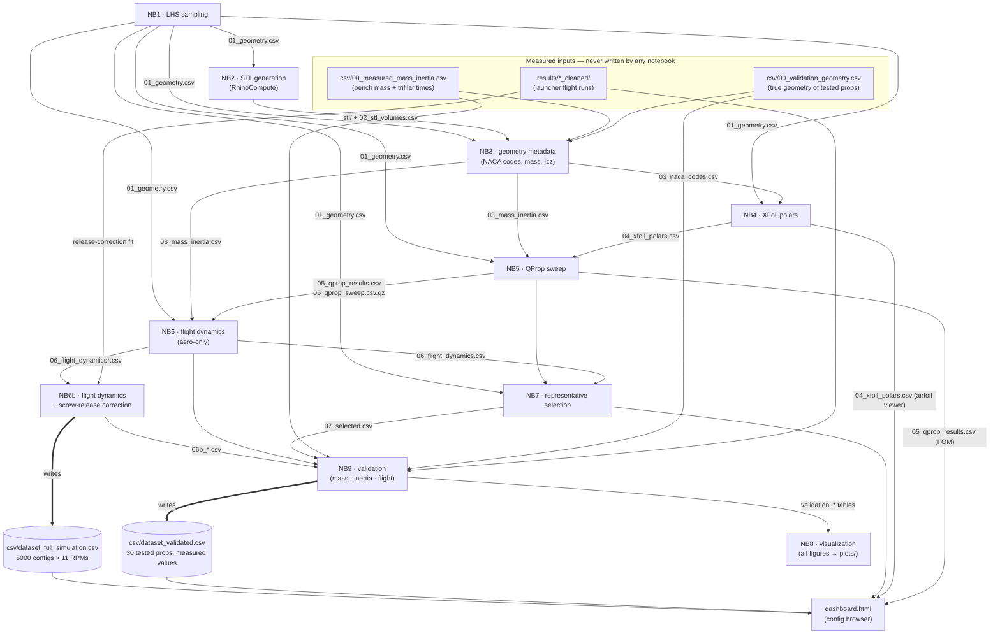

# IDEAL Propeller Characterisation Pipeline

**Data-driven testing and characterisation of 3D-printed propeller performance**

Bachelor Thesis · IDEAL Lab (Chair of Artificial Intelligence in Engineering Design) · ETH Zürich
Author: Héctor Fernández Pinacho · Supervisors: Prof. Dr. Mark Fuge, Arthur Drake

---

## Contents

1. [Project Overview](#1-project-overview)
2. [Physics Background](#2-physics-background)
3. [Installation](#3-installation)
4. [Configuring the Pipeline](#4-configuring-the-pipeline)
5. [Running the Pipeline](#5-running-the-pipeline)
6. [Pipeline DAG](#6-pipeline-dag)
7. [Notebook Reference](#7-notebook-reference)
8. [Outputs and Data-Flow Guide](#8-outputs-and-data-flow-guide)
9. [Browsing the Results](#9-browsing-the-results)

---

## 1. Project Overview

This repository contains an end-to-end, reproducible pipeline that generates a large, systematically varied family of small 3D-printed propellers, predicts the free-flight performance of every design from simulation alone, fabricates a representative subset, and validates the predictions against physical experiments.

A space of **5000 parametric designs** is sampled by constrained Latin Hypercube Sampling, meshed through a parametric Grasshopper generator, and fed through an aerodynamic chain of XFoil airfoil polars, QProp blade-element performance and a free-flight trajectory model. A representative subset of **100 designs** is selected by greedy k-centre sampling and fabricated in SLS nylon, of which **30 are flown** across the full RPM range on a vertical free-flight launcher: a rig that spins each propeller to a fixed rate, releases it, and records its peak climb height. Releasing every design at the same rate isolates the effect of geometry and reduces each test to one fast, repeatable number, so many designs can be compared rather than a handful.

The headline performance metric is **h_max** — how high each propeller flies after release. The validated pipeline yields two flat machine-learning-ready datasets (all 5000 simulated designs across 11 launch RPMs, and the 30 physically validated designs with measured values), a configuration browser web page (`dashboard.html`), and a generation-to-validation framework that other printed-propeller campaigns can reuse.

The pipeline is organised as a strict **directed acyclic graph (DAG)** of nine Jupyter notebooks (Section 6). The only quantity shared across all stages is the configuration identifier `config_id` (0–4999), which acts as a primary key following a propeller from its geometry, through its mass, airfoil data, thrust and predicted flight height, to its physical test record. No stage reads a file produced by a later stage.

Each notebook follows the same internal structure — **1. Imports · 2. Configuration · 3. Function Definitions · 4. Main Code** — with every function documented in the markdown cell that precedes its definition, and closes with pass/fail validation checks on its own outputs.

---

## 2. Physics Background

**Blade sections and polars.** A propeller blade is a twisted, tapered wing; its cross-section at any radius is an airfoil described by chord, thickness and camber. The airfoils used here are NACA 4-digit sections, whose full contour reduces to four digits (max camber %, camber position, thickness %) — convenient because the sampling stage only stores these digits per station. The lift and drag of a section depend on the angle of attack α and are summarised by its *polar*: the lift curve CL(α) (nearly linear until stall) and the drag bucket CD(CL). Section behaviour depends strongly on the Reynolds number Re = V·c/ν. These propellers are small (60–80 mm tip radius) and slow, so many stations operate below Re = 20 000, where the boundary layer forms a laminar separation bubble that raises drag and makes the flow hard to predict. Polars are computed with **XFoil**, a coupled panel / boundary-layer solver that models the laminar-turbulent transition and therefore the bubble; at the very lowest Reynolds numbers XFoil does not always converge, so a documented fallback hierarchy is used.

**Blade-element propeller performance.** Whole-propeller thrust and torque are assembled from the section polars with blade-element theory closed by an induced-flow model, as implemented by **QProp**. Each radial element sees a relative flow combining the axial inflow with the rotational speed ωr; the inflow angle φ sets the local angle of attack α = β − φ (β = geometric pitch). The elemental lift and drag are resolved into thrust dT ∝ CL·cos φ − CD·sin φ and torque dQ ∝ (CL·sin φ + CD·cos φ)·r and integrated over the blades. QProp closes the induced flow through circulation (a blade-element/vortex formulation with a Prandtl tip-loss factor) and solves it with a Newton iteration, returning T and Q at any (V, RPM) operating point. Importantly, the net thrust QProp reports already contains the blades' own profile and induced drag — the flight model must not count blade drag twice.

**Free-flight vertical dynamics.** After release the propeller is a free body climbing under its own thrust with the motor disconnected. Its motion is a coupled 1-DOF system in height h, vertical speed V and spin ω:

```
m·dV/dt = T(V, ω) − m·g − D(V)        D(V) = ½·ρ·Cd_body·A_frontal·V·|V|
I·dω/dt = −Q(V, ω)
dh/dt   = V
```

T(V, ω) and Q(V, ω) are looked up in the pre-computed QProp surfaces at every integrator step; the spin (and with it the thrust) decays continuously because the aerodynamic torque is unopposed. The separate body-drag term covers only the bluff structure QProp does not model — the support-ring rim, the hub, and the blades met edge-on — with a cylinder/annulus Cd ≈ 1.1 applied to the computed axial frontal area. During descent the propeller enters the vortex-ring state that steady blade-element theory cannot represent, so thrust is conservatively set to zero for V < 0. Mass m comes from the STL volume times a calibrated effective SLS print density; the spin-axis inertia Izz comes from the STL inertia tensor with a measured (trifilar-pendulum) linear correction. The trifilar pendulum relates the oscillation period T of a platform on three strings to the inertia via T = 2π·√(I·L/(m·g·r²)).

**The screw-release correction.** The launcher holds the hub on the motor pin by a coarse 3-rib helical thread; braking hard unscrews the still-spinning prop off the pin. This strips most of the spin (retention falls from ≈80 % at 1500 RPM to <10 % at 6000 RPM) and adds a small upward velocity kick (≈1.9 m/s), so the aero-only simulation over-predicts absolute height increasingly with RPM even though it ranks designs well. Because the retained spin is unpredictable per launch (and anti-correlated with performance), the adopted model keeps the clean aerodynamic flight at the target RPM and applies a calibrated **monotonic** height correction `h = A + B·h_aero` fitted on the filtered launcher data (A ≈ 0.29 m kick floor, B ≈ 0.14 magnitude shrink). Monotonicity preserves the design ranking exactly; leave-one-prop-out cross-validation shows the two coefficients generalise. The correction reduces the mean absolute height error from ≈1.4 m to ≈0.2 m and raises the lift-off classification accuracy from ≈48 % to ≈91 %.

**Sampling and selection.** Latin Hypercube Sampling divides each parameter range into n equally probable strata and draws exactly one sample per stratum, covering a 17-dimensional space far more efficiently than random sampling; here it is *constrained* so every design is printable and aerodynamically sensible (wall-thickness floors, solidity caps, chord/thickness taper, monotonic twist, per-station angle-of-attack windows). Choosing which designs to fabricate is a k-centre problem, solved with the greedy farthest-point rule, which guarantees a covering radius within a factor of two of the optimum.

---

## 3. Installation

**Python 3.11 is required.** All dependency versions in `requirements.txt` are pinned against Python 3.11; newer interpreters are not tested and NB2's Rhino bindings ship 3.11 wheels.

1. Install [Python 3.11](https://www.python.org/downloads/) (on Windows, tick *Add python.exe to PATH*).
2. From the pipeline folder, create and activate a virtual environment:

   ```
   py -3.11 -m venv .venv          (Windows)
   .venv\Scripts\activate

   python3.11 -m venv .venv        (macOS / Linux)
   source .venv/bin/activate
   ```

3. Install the pinned dependencies:

   ```
   pip install -r requirements.txt
   ```

4. External tools (already bundled — nothing to install):
   - `utils/xfoil.exe` and `utils/qprop.exe` — Windows binaries used by NB4 and NB5. NB1, NB3, NB6–NB9 are pure Python and run on any OS; NB4/NB5 need Windows (or Wine).
   - **NB2 only:** Rhinoceros 8 must be installed (the notebook launches its bundled RhinoCompute server itself; adjust `RHINO_COMPUTE_EXE` in the notebook's Configuration cell if Rhino lives elsewhere). Every other notebook runs without Rhino.

5. Start Jupyter from the activated environment: `jupyter notebook` (or open the folder in VS Code and select the `.venv` interpreter).

---

## 4. Configuring the Pipeline

All tunable parameters live in a single configuration module, **`pipeline_config.py`**, which every notebook imports: the operating envelope (1500–6500 RPM, reference launch 4000 RPM), physical constants (air density/viscosity, gravity, body-drag Cd), XFoil settings (Ncrit, forced transition, Reynolds grid), QProp sweep grid, ODE tolerances, selection budgets, and every output filename. Each constant is commented in place; change it there, never inside a notebook.

Per-notebook execution knobs (worker counts, overwrite flags, server URLs) live in each notebook's **`## 2. Configuration`** cell, directly after the imports.

Rules of thumb:

- To change a physical or numerical parameter, edit `pipeline_config.py` and re-run from the first affected notebook (see the DAG in Section 6).
- If you widen the RPM envelope, re-run NB5 with `QPROP_OVERWRITE_RUNS = True` first — NB6/NB6b refuse to extrapolate beyond the sweep ceiling.
- Measured data enters the pipeline only through **`utils/measurements.py`**, which owns the canonical paths of the two measured input files and the trifilar-pendulum conversion (Section 8).

---

## 5. Running the Pipeline

**What ships pre-computed.** All `csv/` outputs, both datasets, all figures (`plots/nb1/`…`plots/nb9/`) and both XFoil caches are included, so nothing needs re-running to *use* the results. The bulk artifacts (`stl/` ≈ 9.7 GB, `qprop_output/` ≈ 3.9 GB, `representative_stl/` ≈ 200 MB) are only needed to re-run the corresponding stages from scratch.

**Run order** (each notebook top to bottom; every one self-checks its outputs):

1. **NB1** `1_lhs_sampling.ipynb` — deterministic (fixed seeds); writes `01_geometry.csv` and self-checks all constraints.
2. **NB2** `2_stl_generation.ipynb` — needs Rhino 8; re-runnable, existing STLs and volumes are skipped, and the batch cell retries failed meshes up to `GENERATION_PASSES` times.
3. **NB3** `3_geometry_metadata.ipynb` — needs `csv/00_measured_mass_inertia.csv` and the printed meshes; writes NACA codes, the calibrated mass/inertia table and the `val_03` outputs.
4. **NB4** `4_xfoil_simulation.ipynb` — runs XFoil for every NACA × Re job not already in `xfoil_polars/` (fully cached: with the shipped caches nothing re-runs); writes `04_xfoil_polars.csv` and `val_04_*`.
5. **NB5** `5_qprop_simulation.ipynb` — writes prop files, runs QProp over the 231-point (V, RPM) grid (cached per config), parses and gates the sweep; writes `05_*` and `val_05_*`.
6. **NB6** `6_flight_dynamics.ipynb`, then **NB6b** `6b_flight_dynamics_release.ipynb` — integrate the ODE at all 11 launch RPMs; NB6b fits the release correction on `results/` and writes `dataset_full_simulation.csv`.
7. **NB7** `7_representative_selection.ipynb` — **only when selecting a new fabrication batch.** The shipped `07_selected.csv` records the props that were actually printed and tested; it predates the NB6 drag-model revision, so re-running overwrites it with a different (equally valid) subset.
8. **NB9** `9_validation.ipynb` — three-stage validation (mass, inertia, flight); writes the `validation_*` tables and `dataset_validated.csv`.
9. **NB8** `8_visualization.ipynb` — regenerates every figure; the validation figures read NB9's tables, so run NB8 after NB9 (it skips them gracefully otherwise).

To extend the validated dataset after new experiments: append bench rows to `csv/00_measured_mass_inertia.csv`, drop new cleaned launcher runs under `results/`, and re-run NB3 → NB9 (→ NB8). The dashboard picks the new props up without changes.

---

## 6. Pipeline DAG

The full data flow, from measured inputs and sampling to the two deliverable datasets. Solid arrows are CSV/file dependencies; every notebook also reads `pipeline_config.py`.



NB3–NB6b additionally end with a *Validation Subset* pass that re-runs the identical computation on the 10 early-tested props (their true geometry comes from `csv/00_validation_geometry.csv`, their meshes from `validation_stl/`) and writes `val_`-prefixed twins of every output, using the caches in `xfoil_polars/validation/`, `qprop_input/validation/` and `qprop_output/validation/`. NB9 merges those in automatically, extending the flight validation from 20 to 30 props.

---

## 7. Notebook Reference

### NB1 — `1_lhs_sampling.ipynb` · LHS Geometrical Parameter Sampling

**Purpose:** generate the 5000-design space by constrained Latin Hypercube Sampling over 17 geometry parameters (tip radius, blade count, support ring, and chord/thickness/camber/max-camber-position/pitch at the inner, mid and outer blade sections), enforcing printability and aerodynamic feasibility during sampling.

**Inputs:** none (parameter ranges and constraints from `pipeline_config.py`).
**Outputs:** `csv/01_geometry.csv` — one row per configuration.

Functions: `phi_deg`, `aoa_pitch_bounds`, `sample_from_integer_candidates`, `interpolate_angle_radially`, `feasible_inner_angles_for_hub_aoa`, `select_inner_angle`, `generate_lhs_geometrical_parameters`, `check` — each documented in the notebook's Function Definitions section.

### NB2 — `2_stl_generation.ipynb` · STL Generation

**Purpose:** turn each geometry row into a 3-D mesh by driving the parametric Grasshopper definition (`utils/Propeller_Raul_V1.2.gh`) through a local RhinoCompute server, write binary STLs, compute enclosed volumes, and flag valid single-solid meshes. Requires Rhinoceros 8. The batch cell makes up to `GENERATION_PASSES` passes over failed configs before reporting.

**Inputs:** `csv/01_geometry.csv`.
**Outputs:** `stl/prop_<id>.stl`, `csv/02_stl_volumes.csv` (`volume_L`, `volume_m3`, `stl_ok`, `single_solid`).

Functions: `rhinocompute_is_alive`, `row_to_gh_inputs`, `call_rhinocompute`, `generate_stl`, `iterate_mesh_triangles`, `vertex_xyz`, `write_stl_file`, `stl_volume_cm3`, `stl_shell_count`, `stl_is_single_solid`, `stl_path_for_config`.

### NB3 — `3_geometry_metadata.ipynb` · Geometry Metadata

**Purpose:** derive all geometry-based metadata: per-station NACA codes for XFoil, and mass + spin-axis inertia for every STL at the effective SLS print density calibrated on the measured props, with a measured linear inertia correction (`izz_regressed = a·izz + b`, leave-one-out cross-validated). Ends with the validation-subset pass.

**Inputs:** `csv/01_geometry.csv`, `stl/`, `validation_stl/`, `csv/00_measured_mass_inertia.csv`, `csv/00_validation_geometry.csv`.
**Outputs:** `csv/03_naca_codes.csv`, `csv/03_mass_inertia.csv` (downstream uses `izz_regressed`), calibration audit tables (`03_sls_density_validation.csv`, `03_mass_inertia_validation_regression.csv`, `03_mass_inertia_validation_error_summary.csv`), and `val_02_stl_volumes.csv`, `val_03_mass_inertia.csv`, `val_03_naca_codes.csv`.

Functions: `load_raw_mesh`, `stl_match_sort_key`, `find_stl_path`, `fit_naca_spline`, `naca_code_from_params`, `build_naca_row`, `stl_mass_inertia`, `fit_linear_model`, `loo_cv_abs_error_pct`, `chk`; shared measured-data access via `utils/measurements.py` (`load_measured_mass_inertia_by_id`, `add_measured_izz`).

### NB4 — `4_xfoil_simulation.ipynb` · XFoil Aerodynamic Polar Generation

**Purpose:** compute the ten aerodynamic coefficients QProp needs (CL0, CL_a, CLmin, CLmax, CD0, CD2u, CD2l, CLCD0, REref, REexp) for each of the 7 blade stations of every design, by running XFoil over a geometry-adaptive Reynolds grid with a parameter-keyed on-disk cache, fitting each converged polar, fitting the Reynolds drag-scaling exponent per NACA code, and assigning the best available polar per station through a documented tier hierarchy (`viscous` → `viscous_near_re` → `hub_uses_s1` → `failed`) with a thrust-weighted confidence score. Ends with the validation-subset pass.

**Inputs:** `csv/01_geometry.csv`, `csv/03_naca_codes.csv`, `utils/xfoil.exe` (+ `val_03_naca_codes.csv`).
**Outputs:** `csv/04_xfoil_polars.csv`, `csv/04_xfoil_failed_configs.csv`, `val_04_*` twins; polar caches in `xfoil_polars/` and `xfoil_polars/validation/`.

Functions (grouped as in the notebook) — cache/geometry: `make_polar_cache_filename`, `get_polar_cache_path`, `polar_cache_is_valid`, `get_transition_location_for_re`, `build_chord_or_twist_spline`, `compute_reference_re`, `make_station_row`, `build_station_table`, `derive_re_sample_grid`, `build_job_list`; execution: `build_xfoil_batch_script`, `run_one_xfoil_job`, `run_xfoil_jobs_in_parallel`; parsing/fitting: `read_xfoil_polar_file`, `remove_convergence_glitches`, `get_attached_flow_mask`, `fit_lift_curve`, `fit_drag_polar`, `fit_asymmetric_drag_curvatures`, `evaluate_cd0_at_reference_cl`, `parse_one_polar`; Reynolds scaling and assignment: `fit_re_exponent_for_naca`, `build_re_exponent_table`, `find_nearest_cached_re`, `retrieve_polar_for_station`, `assemble_polar_table`; scoring/reporting: `assign_thrust_region`, `compute_confidence_score_for_config`, `compute_all_confidence_scores`, `order_output_columns`, `report_check`.

### NB5 — `5_qprop_simulation.ipynb` · QProp Performance Sweep

**Purpose:** run QProp for every valid configuration across the full (velocity, RPM) grid — 231 points from hover to 10 m/s, 1500–6500 RPM — as single-point subprocess calls, parse the outputs into the full thrust/torque sweep surfaces plus per-config optima (hover point near launch RPM, best figure of merit, best propulsive efficiency), and gate every row with physical plausibility checks. Ends with the validation-subset pass.

**Inputs:** `csv/01_geometry.csv`, `csv/04_xfoil_polars.csv`, `utils/qprop.exe`, `utils/motor.mas` (+ `val_` inputs).
**Outputs:** `csv/05_qprop_results.csv`, `csv/05_qprop_sweep.csv.gz`, `val_05_*` twins; raw solver files in `qprop_input/props/` and `qprop_output/` (+ `validation/` twins).

Functions: `count_usable`, `station_usable`, `build_prop_text`, `write_prop_files`, `output_is_valid`, `run_config`, `run_qprop_batch`, `is_performance_line`, `parse_file`, `parse_all_outputs`, `apply_plausibility_gates`, `extract_optima`, `assemble_results`, `chk`.

### NB6 — `6_flight_dynamics.ipynb` · Flight Dynamics (aero-only)

**Purpose:** integrate the free-flight ODE for every valid configuration at each of the 11 launch RPMs, with bilinear T/Q lookup, the corrected inertia, the computed axial frontal area for body drag, a sweep-coverage guard that refuses to extrapolate beyond the QProp RPM ceiling, and per-config coverage checks. Ends with the validation-subset pass.

**Inputs:** `csv/01_geometry.csv`, `02_stl_volumes.csv`, `03_mass_inertia.csv`, `05_qprop_results.csv`, `05_qprop_sweep.csv.gz` (+ `val_` equivalents).
**Outputs:** `csv/06_flight_dynamics_<rpm>rpm.csv` ×11, reference `csv/06_flight_dynamics.csv`, `val_06_*` twins.

Functions: `load_sweep_surfaces`, `check_sweep_rpm_coverage`, `build_base_table`, `add_inertia_and_drag_areas`, `build_performance_surface`, `build_all_surfaces`, `surface_omega_max`, `interp_surface`, `ground_hit`, `make_eom`, `simulate_config`, `make_skip_record`, `simulate_all_rpms`, `chk`.

### NB6b — `6b_flight_dynamics_release.ipynb` · Flight Dynamics with Screw-Release Model

**Purpose:** the release-corrected companion of NB6. Runs the identical aero ODE (preserving trajectory and ranking), then fits the monotonic correction `h = A + B·h_aero` live on the PASS-only, spike-filtered, uncensored launcher heights (the same cleaned data NB9 validates against) and applies it to every per-RPM table. Also assembles the **full simulation dataset**. Ends with the validation-subset pass.

**Inputs:** as NB6, plus the cleaned launcher runs in `results/*_cleaned/`.
**Outputs:** `csv/06b_flight_dynamics_release_<rpm>rpm.csv` ×11, reference `csv/06b_flight_dynamics_release.csv`, calibration `csv/06b_release_calibration.csv`, **`csv/dataset_full_simulation.csv`**, and the `val_06b_*` equivalents.

Functions: everything NB6 defines (the 6b `simulate_config` exposes `h_max_aero_m` and defers the corrected `h_max_m` until A and B are fitted), plus the calibration set `read_run_trace`, `rpm_confirmed_peak`, `load_filtered_measured`, `fit_release_correction`.

### NB7 — `7_representative_selection.ipynb` · Representative Propeller Selection

**Purpose:** select the unified 100-prop subset for fabrication: Band 0 (8 near-boundary non-liftoff props, T/W ∈ [0.70, 1.00)) plus Band 1 (92 liftoff props across 4 equal-quantile h_max tiers), each chosen by greedy k-centre over six normalised geometry features; validate the subset, visualise its coverage, and copy the selected STLs.

**Inputs:** `csv/06_flight_dynamics.csv` (reference RPM), `01_geometry.csv`, `03_mass_inertia.csv`, `05_qprop_results.csv`.
**Outputs:** `csv/07_selected.csv`, `csv/07_all_subsets.csv`, `plots/nb7/07_selection_coverage.png`, `representative_stl/`.

Functions: `greedy_maxmin`, `select_from_band`, `chk`.

> ⚠️ The shipped `07_selected.csv` records the props that were **actually printed and tested**; it predates the NB6 drag-model revision, so re-running NB7 on current data produces a different (equally valid) subset and overwrites the file. Re-run only to select a *new* fabrication batch.

### NB8 — `8_visualization.ipynb` · Design-Space and Pipeline Visualisation

**Purpose:** every figure of the project, written as PNG into one tree with a subfolder per pipeline stage (`plots/nb1/` … `plots/nb9/`). Per-stage diagnostics (LHS coverage and correlation, radial blade-shape envelope, volume/mass/inertia distributions, XFoil tier and convergence views, QProp performance and 3-D operating surfaces, aero-vs-release heights, selection coverage, full-pipeline correlation matrix) plus the high-resolution single-concept results figures — the generation/aero/selection set, the illustrative low-Reynolds polar (from the pipeline's own coefficient fit), a single simulated trajectory (integrating exactly the NB6 equations), the full validation figure set (which reads the tables NB9 saves and is skipped gracefully until NB9 has run), and the spin-retention curve recomputed from the raw launcher traces.

**Inputs:** all pipeline CSVs (read-only), the NB9 validation tables when present, and the cleaned launcher runs in `results/*_cleaned/` for the retention curve.
**Outputs:** PNG figures in `plots/nb1/` … `plots/nb9/`, plus `csv/06b_release_retention_curve_recomputed.csv`.

Functions — shared helpers: `load`, `savefig`, `histplot`, `badge`, `radial_profile`, `plot_surface_box`, `save_hires`, `need`, `header`; pipeline hires figures: `loft_three`, `loft_naca`, `fig_gen_param_distributions`, `fig_gen_radial_evolution`, `fig_selection_coverage`, `fig_aero_polar_tiers`, `fig_aero_xfoil_convergence`, `fig_aero_confidence_hist`, `load_sweep_config`, `surface_plot_hires`, `fig_aero_qprop_surfaces`, `pick_polar_section`, `qprop_polar`, `fig_lowre_polar`, `build_trajectory_surface`, `interp_trajectory_surface`, `make_trajectory_eom`, `trajectory_ground_hit`, `fig_release_trajectory`; validation results figures: `spearman_rho`, `fig_val_mass_scatter`, `inertia_stats`, `fig_val_inertia_scatter`, `load_matched_csv`, `flight_scatter_hires`, `figs_flight_scatters`, `fig_flight_height_vs_rpm`, `fig_flight_liftoff_accuracy`, `fig_flight_kick_evidence`, `fig_flight_confidence_vs_mae`, `fig_flight_ranking_vs_rpm`; spin-retention recompute: `parse_target_rpm`, `read_release_trace`, `kinematic_deglitch_mask`, `release_rpm`, `fig_flight_retention_curve`.

### NB9 — `9_validation.ipynb` · Validation (Mass, Inertia, Simulation)

**Purpose:** the full validation against physical measurements. Stage 1: mass vs scale. Stage 2: inertia vs trifilar pendulum (raw and corrected). Stage 3: simulated vs measured flight height over all 30 tested props — PASS-only spike-filtered runs, isotonic-regressed measured target, right-censoring at the string ceiling with a separate qualitative agreement check, leave-one-prop-out cross-validation of the release correction, global / per-RPM / per-config ranking readings, the void-free-surface robustness check and the liftoff-classification accuracy. Assembles the **validated dataset**. The high-resolution results figures over these tables are generated centrally by NB8.

**Inputs:** measured data via `utils/measurements.py`, `stl/`, `results/*_cleaned/`, `07_selected.csv`, the per-RPM `06_*`/`06b_*` files and their `val_` twins, `06b_release_retention_curve.csv`, `05_qprop_sweep.csv.gz`.
**Outputs:** `csv/validation_mass_inertia.csv`, `validation_sim_matched.csv`, `validation_sim_ranking_per_config.csv`, `validation_master_summary.csv`, `validation_per_rpm_summary.csv`, `validation_secondary_summary.csv`, **`csv/dataset_validated.csv`**, diagnostic figures in `plots/nb9/`.

Functions — reporting/physics: `error_metrics_report`, `trifilar_inertia_kg_m2`, `find_stl_path`, `stl_shape_properties`, `percent_error_report`, `ranking_metrics`, `smooth_monotone_curve`, `signed_fmt`, `plain_fmt`; run cleaning and loading: `parse_run_filename`, `read_run_trace`, `kinematic_deglitch`, `rpm_confirmed_peak`, `load_pass_runs`, `isotonic_increasing`, `aggregate_pass_cells`, `load_sim_long`, `index_run_trajectories`; analysis: `fit_release_AB`, `global_row`, `per_rpm_table`, `summary_block`, `scatter_panel`, `per_rpm_rank`, `per_rpm_err`, `make_grid`, `cell_is_clean`, `void_block`.

---

## 8. Outputs and Data-Flow Guide

**Naming convention.** `csv/<NB>_<name>.csv` marks the notebook that writes a file (`01_geometry.csv` ← NB1, `06b_*` ← NB6b, …). `csv/00_*` are **measured inputs** (never written by any notebook). `csv/val_*` are the validation-subset twins of the numbered outputs. `csv/validation_*` are NB9's result tables. The two dataset files are the headline deliverables.

**Measured inputs** (access them only through `utils/measurements.py`):

| File | Content | Written by | Read by |
|---|---|---|---|
| `csv/00_measured_mass_inertia.csv` | `config_id, mass_g, T_meas` — scale mass and trifilar time (10 oscillations) per fabricated prop | you (append new bench measurements) | NB3 (calibration), NB9 (validation) |
| `csv/00_validation_geometry.csv` | true geometry of every flight-tested prop, with `geometry_source` and `stl_source` | fixed record | NB3–NB6b (validation subset), NB9 |
| `results/*_cleaned/` | launcher runs (`<id>_<blades>_<rpm>_<run>_cleaned.csv`) + `cleaned_validation_report.csv` | test campaigns | NB6b (calibration), NB8 (retention), NB9 |

**The two datasets:**

- **`csv/dataset_full_simulation.csv`** (written by NB6b) — 55 000 rows = 5000 configs × 11 launch RPMs; 40 columns: identifiers (`config_id`, `rpm_launch`), the 17 geometry parameters, mass/inertia/drag areas, `confidence_score`, the quality flags (`stl_ok`, `qprop_ok`, `flight_ok`, `can_liftoff`), and all flight outputs (`T_static_N`, `Q_static_Nm`, `Pshaft_static_W`, `T_over_W`, `h_max_aero_m`, `h_max_m`, `flight_time_s`, `hover_time_s`, `v_max_m_s`, `v_impact_m_s`, `rpm_at_impact`), plus `data_source = simulation`. For model training, filter on the quality flags and use `h_max_aero_m` (pure aerodynamics) or `h_max_m` (what the launcher achieves) as the target.
- **`csv/dataset_validated.csv`** (written by NB9) — one row per physically tested (config, RPM) cell (currently 222 rows over 30 props), **same schema**, with measured values wherever a measurement exists: the true printed geometry, bench mass and trifilar inertia, and the launcher height (`h_max_m` = isotonic-regressed PASS-mean). Simulation-only fields are left empty rather than filled with simulated numbers; the simulated heights are appended as `h_sim_release_m` / `h_sim_aero_m`, together with `meas_h_median/mean/min/max`, `n_pass_runs`, `meas_censored` and `geometry_source`. **It grows automatically**: add bench rows to `00_measured_mass_inertia.csv` and new cleaned launcher runs under `results/`, re-run NB9, and the new props appear (the dashboard picks them up without changes).

**Other output folders.** `stl/` (all meshes), `representative_stl/` (the 100 fabricated), `validation_stl/` (true meshes of the 10 early-tested props), `xfoil_polars/` (+`validation/`) — cached XFoil polar files, `qprop_input/props/` and `qprop_output/` (+`validation/`) — raw QProp solver files, `plots/nb1/`…`plots/nb9/` — all figures as PNG.

**Reading and writing rules.** Never edit numbered outputs by hand — re-run the notebook that owns them. To add measurements, append to the `00_*` inputs / `results/` and re-run NB3 → (NB4–NB6b if geometry-affecting) → NB9. To change a parameter, edit `pipeline_config.py` and re-run from the first affected notebook.

---

## 9. Browsing the Results

From the pipeline folder run `python -m http.server 8000` and open `http://localhost:8000/dashboard.html` (the page loads the CSVs over HTTP, so it needs a local server rather than a `file://` open).

The dashboard has three tabs:

- **Overview** — distributions of all 17 geometric parameters, radial evolution of chord/twist/thickness across the sampled designs, and the performance panels (mass, inertia, static thrust, static torque, figure of merit, T/W, peak heights, flight time, confidence, climb speed, shaft power) plus the T/W-vs-height and height-vs-RPM summary charts, all switchable by launch RPM.
- **Browse** — filterable, sortable list of all 5000 configs. Each propeller card shows a live 3-D STL render, the full geometry groups, the **QProp airfoil viewer** (outline previews of the hub and s1–s6 NACA sections; click any airfoil for its reconstructed polar, source tier — *Viscous solution*, *Closest Re match* or *Other fallback* — and full metadata; discarded stations appear red with the reason), performance at the selected RPM, the height-vs-RPM sparkline, and — for tested props — simulated-vs-measured tables with per-cell Δ%. Up to four configs can be compared side by side.
- **Subset** — the 100 fabricated props with PCA coverage plots of the design space.

The page adapts to CSV growth automatically: new rows, RPM levels or validated props appear without editing the HTML.
